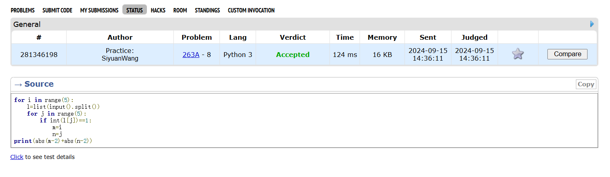
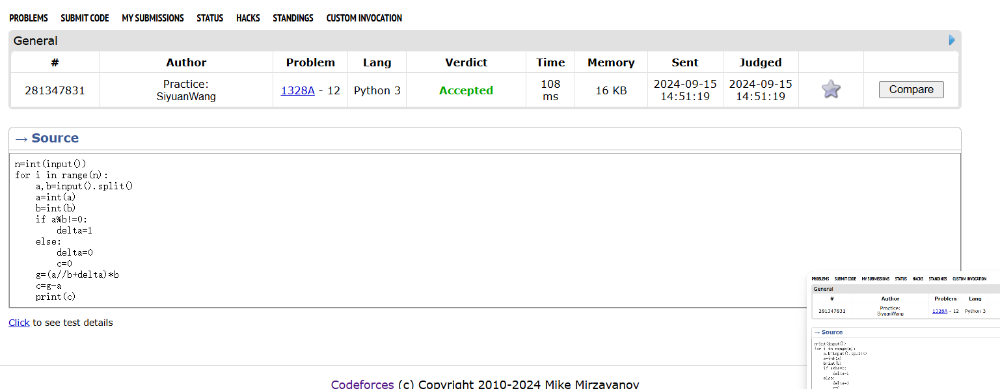
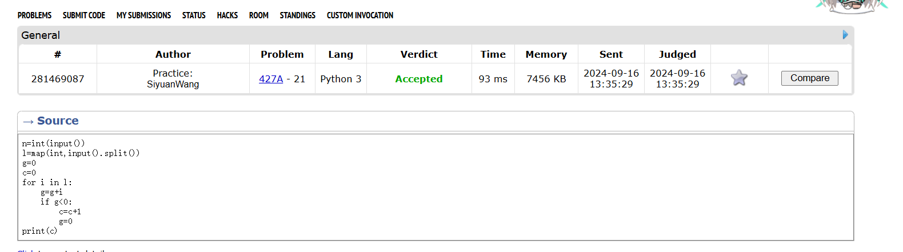
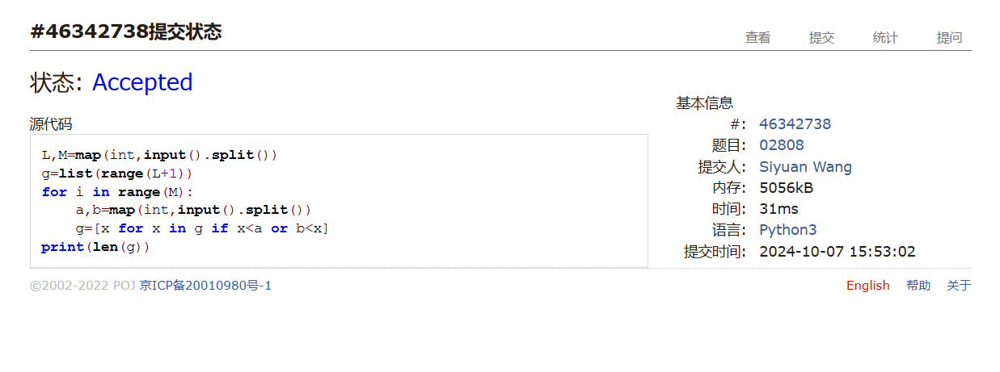
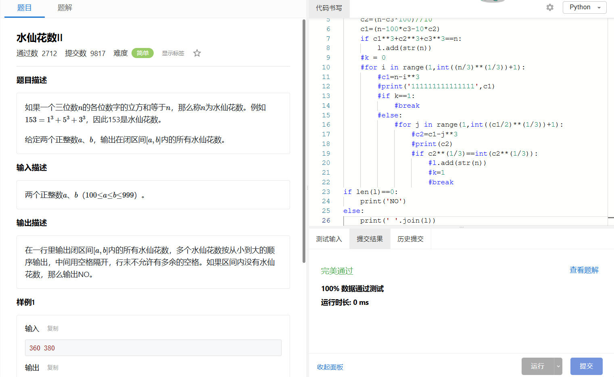
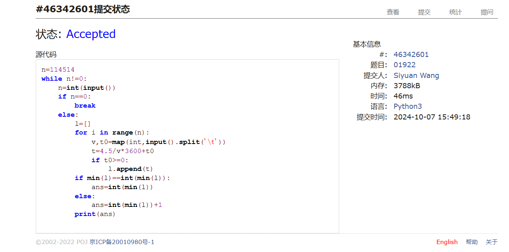

# Assignment #2: 语法练习

Updated 0126 GMT+8 Sep 24, 2024

2024 fall, Complied by ==同学的姓名、院系==


**说明：**

1）请把每个题目解题思路（可选），源码Python, 或者C++（已经在Codeforces/Openjudge上AC），截图（包含Accepted），填写到下面作业模版中（推荐使用 typora https://typoraio.cn ，或者用word）。AC 或者没有AC，都请标上每个题目大致花费时间。

3）课程网站是Canvas平台, https://pku.instructure.com, 学校通知9月19日导入选课名单后启用。**作业写好后，保留在自己手中，待9月20日提交。**

提交时候先提交pdf文件，再把md或者doc文件上传到右侧“作业评论”。Canvas需要有同学清晰头像、提交文件有pdf、"作业评论"区有上传的md或者doc附件。

4）如果不能在截止前提交作业，请写明原因。


## 1. 题目

### 263A. Beautiful Matrix

https://codeforces.com/problemset/problem/263/A


思路：


##### 代码

```python
# 
for i in range(5):
    l=list(input().split())
    for j in range(5):
        if int(l[j])==1:
            m=i
            n=j
print(abs(m-2)+abs(n-2))
```


代码运行截图 ==（至少包含有"Accepted"）==



### 1328A. Divisibility Problem

https://codeforces.com/problemset/problem/1328/A


思路：


##### 代码

```python
# 
n=int(input())
for i in range(n):
    a,b=input().split()
    a=int(a)
    b=int(b)
    if a%b!=0:
        delta=1
    else:
        delta=0
        c=0
    g=(a//b+delta)*b
    c=g-a
    print(c)
```


代码运行截图 ==（至少包含有"Accepted"）==



### 427A. Police Recruits

https://codeforces.com/problemset/problem/427/A


思路：


##### 代码

```python
# 
n=int(input())
l=map(int,input().split())
g=0
c=0
for i in l:
    g=g+i
    if g<0:
        c=c+1
        g=0
print(c)
```


代码运行截图 ==（AC代码截图，至少包含有"Accepted"）==



### 02808: 校门外的树

http://cs101.openjudge.cn/practice/02808/


思路：


##### 代码

```python
# 
L,M=map(int,input().split())
g=list(range(L+1))
for i in range(M):
    a,b=map(int,input().split())
    g=[x for x in g if x<a or b<x]
print(len(g))
```


代码运行截图 ==（AC代码截图，至少包含有"Accepted"）==



### sy60: 水仙花数II

https://sunnywhy.com/sfbj/3/1/60


思路：


##### 代码

```python
# 
a,b=map(int,input().split())
l=set([])
for n in range(a,b+1):
    c3=n//100
    c2=(n-c3*100)//10
    c1=(n-100*c3-10*c2)
    if c1**3+c2**3+c3**3==n:
        l.add(str(n))
if len(l)==0:
    print('NO')
else:
    print(' '.join(l))
```


代码运行截图 ==（AC代码截图，至少包含有"Accepted"）==



### 01922: Ride to School

http://cs101.openjudge.cn/practice/01922/


思路：


##### 代码

```python
# 
n=114514
while n!=0:
    n=int(input())
    if n==0:
        break
    else:
        l=[]
        for i in range(n):
            v,t0=map(int,input().split('\t'))
            t=4.5/v*3600+t0
            if t0>=0:
                l.append(t)
        if min(l)==int(min(l)):
            ans=int(min(l))
        else:
            ans=int(min(l))+1
        print(ans)


```


代码运行截图 ==（AC代码截图，至少包含有"Accepted"）==



## 2. 学习总结和收获

==如果作业题目简单，有否额外练习题目，比如：OJ“计概2024fall每日选做”、CF、LeetCode、洛谷等网站题目。==
继续做每日选做,开课后才开始做,所以有很多积留的,然后不是每天都有时间能做,所以整体上往前赶的速度不是很快,但是仍然保持积攒的题在慢慢减少,国庆会集中做很多.随着进一步做题遇到了更多更复杂的问题,比如第一次遇到了代码超时,接触应用浅拷贝深拷贝等,感觉到水平在提升,但还有一段路要走.


