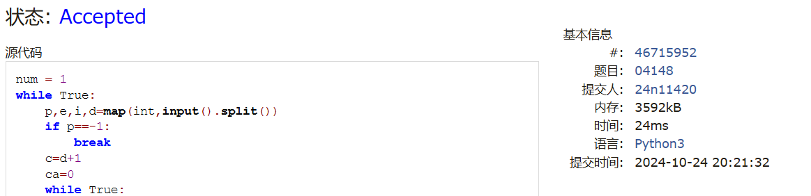
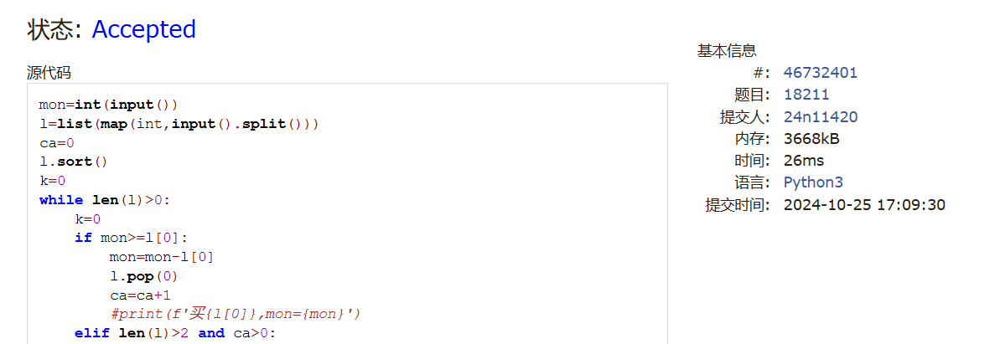
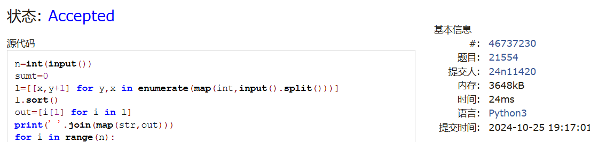
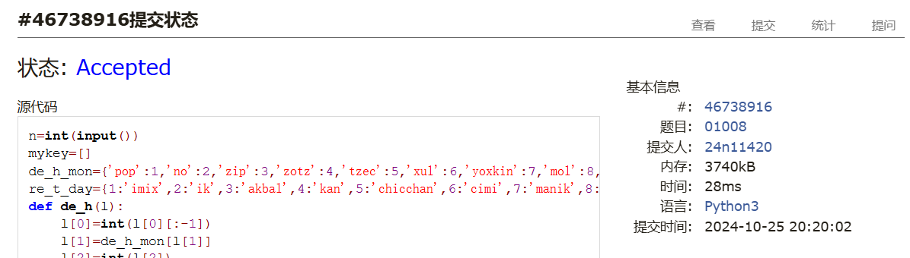
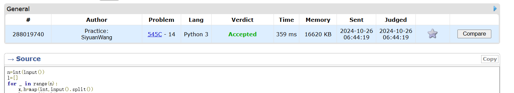
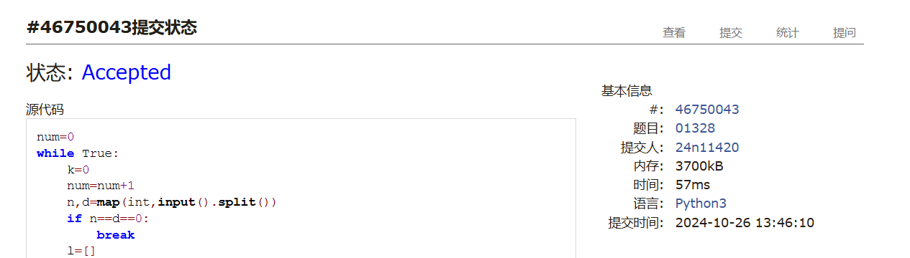

# Assignment #5: Greedy穷举Implementation

Updated 1939 GMT+8 Oct 21, 2024

2024 fall, Complied by <mark>王思远物理学院</mark>


**说明：**

1）请把每个题目解题思路（可选），源码Python, 或者C++（已经在Codeforces/Openjudge上AC），截图（包含Accepted），填写到下面作业模版中（推荐使用 typora https://typoraio.cn ，或者用word）。AC 或者没有AC，都请标上每个题目大致花费时间。

3）提交时候先提交pdf文件，再把md或者doc文件上传到右侧“作业评论”。Canvas需要有同学清晰头像、提交文件有pdf、"作业评论"区有上传的md或者doc附件。

4）如果不能在截止前提交作业，请写明原因。


## 1. 题目

### 04148: 生理周期

brute force, http://cs101.openjudge.cn/practice/04148

思路：


代码：

```python
num = 1
while True:
    p,e,i,d=map(int,input().split())
    if p==-1:
        break
    c=d+1
    ca=0
    while True:
        if (c-i)%33==0:
            ca=1
        if abs(c-p)%23==0 and abs(c-e)%28==0 and abs(c-i)%33==0:
            break
        elif ca==0:
            c=c+1
        else:
            c=c+33
    print(f'Case {num}: the next triple peak occurs in {c-d} days.')
    num=num+1
```


代码运行截图 <mark>（至少包含有"Accepted"）</mark>



### 18211: 军备竞赛

greedy, two pointers, http://cs101.openjudge.cn/practice/18211

思路：


代码：

```python
mon=int(input())
l=list(map(int,input().split()))
ca=0
l.sort()
k=0
while len(l)>0:
    k=0
    if mon>=l[0]:
        mon=mon-l[0]
        l.pop(0)
        ca=ca+1
        #print(f'买{l[0]},mon={mon}')
    elif len(l)>2 and ca>0:
        if len(l)%2==0:
            g=len(l)//2-1
        else:
            g=len(l)//2
        for i in range(1,g+1):
            mdd=mon+sum(l[-i:])-sum(l[:i+1])
            if mdd>=0:
                ca=ca+1
                l=l[i+1:-i]
                mon=mdd
                k=0
                #print(f'卖{l[-i:]},买{l[:i+1]},mon={mon}')
                break
            else:
                k=1
        if k==1 or g==0:
            break
    else:
        break
print(ca)
```


代码运行截图 ==（至少包含有"Accepted"）==



### 21554: 排队做实验

greedy, http://cs101.openjudge.cn/practice/21554

思路：


代码：

```python
n=int(input())
sumt=0
l=[[x,y+1] for y,x in enumerate(map(int,input().split()))]
l.sort()
out=[i[1] for i in l]
print(' '.join(map(str,out)))
for i in range(n):
    sumt=l[i][0]*(n-i-1)+sumt
print(f'{sumt/n:.2f}')
```


代码运行截图 <mark>（至少包含有"Accepted"）</mark>



### 01008: Maya Calendar

implementation, http://cs101.openjudge.cn/practice/01008/

思路：


代码：

```python
n=int(input())
mykey=[]
de_h_mon={'pop':1,'no':2,'zip':3,'zotz':4,'tzec':5,'xul':6,'yoxkin':7,'mol':8,'chen':9,'yax':10,'zac':11,'ceh':12,'mac':13,'kankin':14,'muan':15,'pax':16,'koyab':17,'cumhu':18,'uayet':19}
re_t_day={1:'imix',2:'ik',3:'akbal',4:'kan',5:'chicchan',6:'cimi',7:'manik',8:'lamat',9:'muluk',10:'ok',11:'chuen',12:'eb',13:'ben',14:'ix',15:'mem',16:'cib',17:'caban',18:'eznab',19:'canac',0:'ahau'}
def de_h(l):
    l[0]=int(l[0][:-1])
    l[1]=de_h_mon[l[1]]
    l[2]=int(l[2])
    return 1+l[0]+20*(l[1]-1)+365*l[2]
def re_t(da):
    l=[0,0,0]
    l[2]=da//260
    l[0]=(da%260)%13
    if l[0]==0:
        l[0]=13
    l[1]=re_t_day[(da%260)%20]
    if da%260==0:
        l[2]=l[2]-1
    return l
print(n)
for _ in range(n):
    l_h=list(input().split())
    day=de_h(l_h)
    print(' '.join(map(str,re_t(day))))
```


代码运行截图 <mark>（至少包含有"Accepted"）</mark>



### 545C. Woodcutters

dp, greedy, 1500, https://codeforces.com/problemset/problem/545/C

思路：


代码：

```python
n=int(input())
l=[]
for _ in range(n):
    x,h=map(int,input().split())
    l.append([x,h])
l.sort()
if n>1:
    c=2
if n==1:
    c=1
for i in range(1,n-1):
    if abs(l[i-1][0]-l[i][0])>l[i][1]:
        c+=1
    elif abs(l[i+1][0]-l[i][0])>l[i][1]:
        c+=1
        l[i][0]=l[i][1]+l[i][0]
print(c)
 
```


代码运行截图 <mark>（至少包含有"Accepted"）</mark>



### 01328: Radar Installation

greedy, http://cs101.openjudge.cn/practice/01328/

思路：


代码：

```python
num=0
while True:
    k=0
    num=num+1
    n,d=map(int,input().split())
    if n==d==0:
        break
    l=[]
    for _ in range(n):
        x,y=map(int,input().split())
        l.append([x,y])
    l.sort()
    if d-l[0][1]<0:
        print(f'Case {num}: {-1}')
    else:
        ma=l[0][0]+(d**2-l[0][1]**2)**0.5
        #print(l[0])
        #print(ma)
        c=1
        for i in l:
            if d-i[1]<0:
                print(f'Case {num}: {-1}')
                k=1
                break
            if i[0]-(d**2-i[1]**2)**0.5<=ma:
                #print(i)
                #print(i[0]-(d**2-i[1]**2)**0.5)
                ma=min(i[0]+(d**2-i[1]**2)**0.5,ma)
                #print(ma)
            else:
                c=c+1
                ma=i[0]+(d**2-i[1]**2)**0.5
        if k!=1:
            print(f'Case {num}: {c}')
    _=input()
```


代码运行截图 <mark>（至少包含有"Accepted"）</mark>



## 2. 学习总结和收获

<mark>如果作业题目简单，有否额外练习题目，比如：OJ“计概2024fall每日选做”、CF、LeetCode、洛谷等网站题目。</mark>
每日选做没做到最新进度加上快期中考试了,前半周在做每日选做,后半周做了作业,
考完期中多赶一赶每日选做吧,一些oj的题样例很少,只有一个样例,有时候靠手搓或者找GPT出样例,挺复杂一个题样例只有一组数据一两个数据点,有一次程序几乎处处写错样例都能过,记得之前有个题题目说输入多组数据样例只给了一组,WA我才发现该接收好几组数据,忘了是不是oj上的了,希望考试不要样例给这么少.


