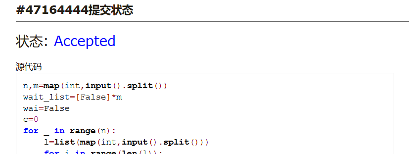
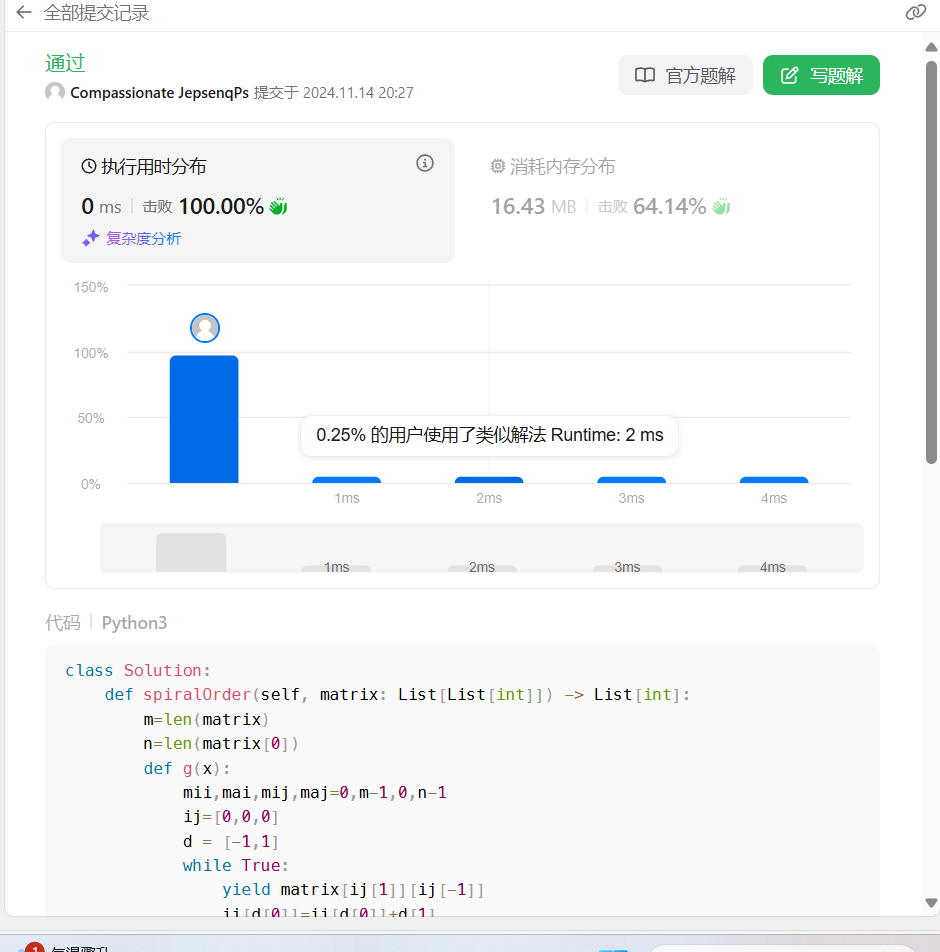
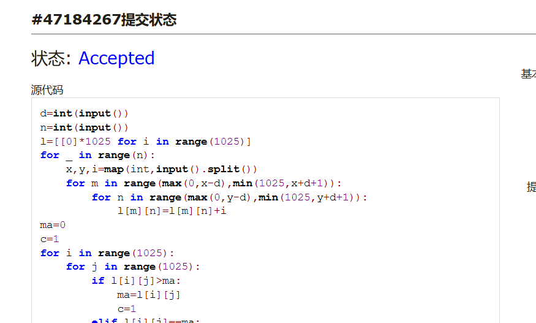
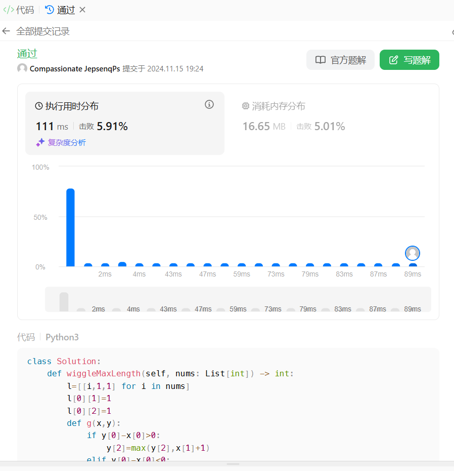
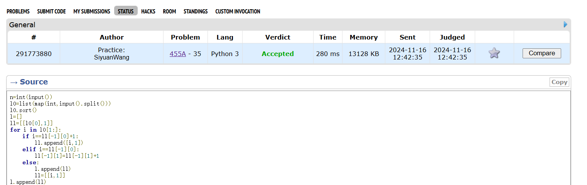
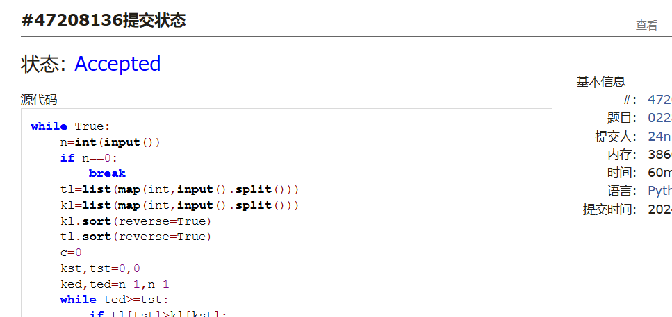

# Assignment #8: 田忌赛马来了

Updated 1021 GMT+8 Nov 12, 2024

2024 fall, Complied by <mark>同学的姓名、院系</mark>


**说明：**

1）请把每个题目解题思路（可选），源码Python, 或者C++（已经在Codeforces/Openjudge上AC），截图（包含Accepted），填写到下面作业模版中（推荐使用 typora https://typoraio.cn ，或者用word）。AC 或者没有AC，都请标上每个题目大致花费时间。

2）提交时候先提交pdf文件，再把md或者doc文件上传到右侧“作业评论”。Canvas需要有同学清晰头像、提交文件有pdf、"作业评论"区有上传的md或者doc附件。

3）如果不能在截止前提交作业，请写明原因。


## 1. 题目

### 12558: 岛屿周⻓

matices, http://cs101.openjudge.cn/practice/12558/ 

思路：


代码：

```python
n,m=map(int,input().split())
wait_list=[False]*m
wai=False
c=0
for _ in range(n):
    l=list(map(int,input().split()))
    for i in range(len(l)):
        if l[i]==1:
            if wait_list[i]:
                if wai:
                    c=c+0
                else:
                    c=c+2
            else:
                if wai:
                    c=c+2
                else:
                    c=c+4
            wait_list[i]=True
            wai=True
        else:
            wait_list[i]=False
            wai=False
    wai=False
print(c)
```


代码运行截图 <mark>（至少包含有"Accepted"）</mark>



### LeetCode54.螺旋矩阵

matrice, https://leetcode.cn/problems/spiral-matrix/

与OJ这个题目一样的 18106: 螺旋矩阵，http://cs101.openjudge.cn/practice/18106

思路：


代码：

```python
class Solution:
    def spiralOrder(self, matrix: List[List[int]]) -> List[int]:
        m=len(matrix)
        n=len(matrix[0])
        def g(x):
            mii,mai,mij,maj=0,m-1,0,n-1
            ij=[0,0,0]
            d = [-1,1]
            while True:
                yield matrix[ij[1]][ij[-1]]
                ij[d[0]]=ij[d[0]]+d[1]
                if mii<=ij[1]<=mai and mij<=ij[-1]<=maj:
                    pass
                elif mii>ij[1] or ij[1]>mai:
                    if d[0]==1 and d[1]==1:
                        maj=maj-1
                    elif d[0]==1 and d[1]==-1:
                        mij=mij+1
                    ij[d[0]]=ij[d[0]]-d[1]
                    d[0]=-d[0]
                    d[1]=-d[1]
                    ij[d[0]] = ij[d[0]] + d[1]
                else:
                    if d[0] == -1 and d[1] == 1:
                        mii = mii + 1
                    elif d[0] == -1 and d[1] == -1:
                        mai = mai - 1
                    ij[d[0]]=ij[d[0]]-d[1]
                    d[0]=-d[0]
                    ij[d[0]] = ij[d[0]] + d[1]
        ge=g(0)
        key=[]
        for i in range(m*n):
            key.append(next(ge))
        return key
```


代码运行截图 ==（至少包含有"Accepted"）==



### 04133:垃圾炸弹

matrices, http://cs101.openjudge.cn/practice/04133/

思路：


代码：

```python
d=int(input())
n=int(input())
l=[[0]*1025 for i in range(1025)]
for _ in range(n):
    x,y,i=map(int,input().split())
    for m in range(max(0,x-d),min(1025,x+d+1)):
        for n in range(max(0,y-d),min(1025,y+d+1)):
            l[m][n]=l[m][n]+i
ma=0
c=1
for i in range(1025):
    for j in range(1025):
        if l[i][j]>ma:
            ma=l[i][j]
            c=1
        elif l[i][j]==ma:
            c=c+1
print(c,ma)
```


代码运行截图 <mark>（至少包含有"Accepted"）</mark>



### LeetCode376.摆动序列

greedy, dp, https://leetcode.cn/problems/wiggle-subsequence/

与OJ这个题目一样的，26976:摆动序列, http://cs101.openjudge.cn/routine/26976/

思路：


代码：

```python
class Solution:
    def wiggleMaxLength(self, nums: List[int]) -> int:
        l=[[i,1,1] for i in nums]
        l[0][1]=1
        l[0][2]=1
        def g(x,y):
            if y[0]-x[0]>0:
                y[2]=max(y[2],x[1]+1)
            elif y[0]-x[0]<0:
                y[1]=max(y[1],x[2]+1)
        for i in range(1,len(nums)):
            for j in range(0,i):
                g(l[j],l[i])
        #n=max(max(l[i][1] for i in range(len(nums))),max(l[i][2] for i in range(len(nums))))
        n=max(l[i][k]for i in range(len(nums)) for k in range(1,3))
        return(n)
        #print(l)
```


代码运行截图 <mark>（至少包含有"Accepted"）</mark>



### CF455A: Boredom

dp, 1500, https://codeforces.com/contest/455/problem/A

思路：


代码：

```python
n=int(input())
l0=list(map(int,input().split()))
l0.sort()
l=[]
ll=[[l0[0],1]]
for i in l0[1:]:
    if i==ll[-1][0]+1:
        ll.append([i,1])
    elif i==ll[-1][0]:
        ll[-1][1]=ll[-1][1]+1
    else:
        l.append(ll)
        ll=[[i,1]]
l.append(ll)
def g(x):
    if len(x)>2:
        lis=[x[0][0]*x[0][1], x[1][0]*x[1][1], x[0][0]*x[0][1]+x[2][0]*x[2][1]]
        for i in x[min(len(x),3):]:
            lis.append(max(lis[-2]+i[0]*i[1],lis[-3]+i[0]*i[1]))
        #print(lis)
        return max(lis[-1],lis[-2])
    else:
        return max(i[0]*i[1] for i in x)
print(sum(g(i) for i in l))
#print(l)
```


代码运行截图 <mark>（至少包含有"Accepted"）</mark>



### 02287: Tian Ji -- The Horse Racing

greedy, dfs http://cs101.openjudge.cn/practice/02287

思路：


代码：

```python
while True:
    n=int(input())
    if n==0:
        break
    tl=list(map(int,input().split()))
    kl=list(map(int,input().split()))
    kl.sort(reverse=True)
    tl.sort(reverse=True)
    c=0
    kst,tst=0,0
    ked,ted=n-1,n-1
    while ted>=tst:
        if tl[tst]>kl[kst]:
            tst=tst+1
            kst=kst+1
            c=c+200
        elif tl[ted]>kl[ked]:
            ted=ted-1
            ked=ked-1
            c=c+200
        else:
            if kl[kst]>tl[ted]:
                c=c-200
            ted = ted - 1
            kst = kst + 1
    print(c)
```


代码运行截图 <mark>（至少包含有"Accepted"）</mark>



## 2. 学习总结和收获

<mark>如果作业题目简单，有否额外练习题目，比如：OJ“计概2024fall每日选做”、CF、LeetCode、洛谷等网站题目。</mark>
这次题确有难度，但感觉不是这几周最难的，摆动序列做出来发现太慢了，
看题解后发现思路确实复杂了，重写了之后发现没什么可以优化的了没有再提交，
leetcode能看到各种运行情况的代码挺好的，就是一开始不太会用，
田忌赛马确实有难度，自己写的代码改了又改，打了一堆补丁之后问了GPT，
但是GPT写的不太对，最后是学了GPT的思路自己改的。感觉收获还是不小的。


