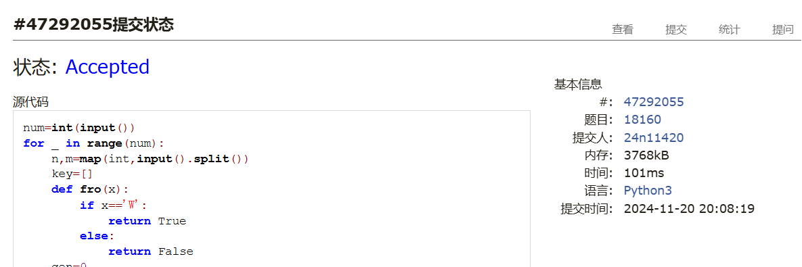
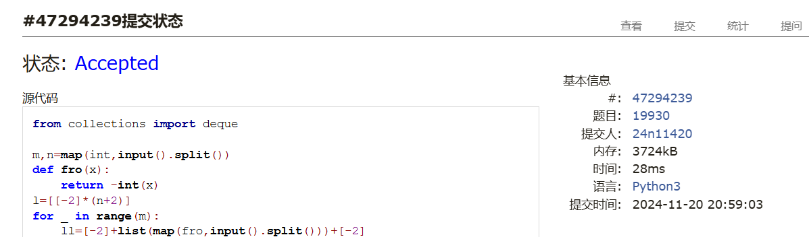
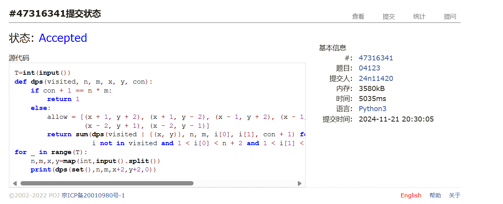
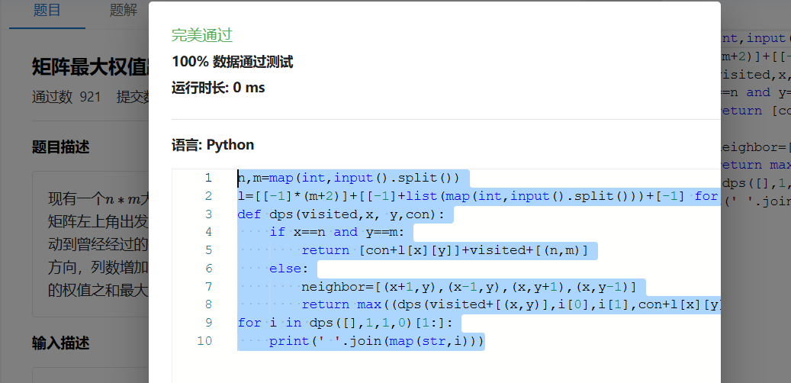
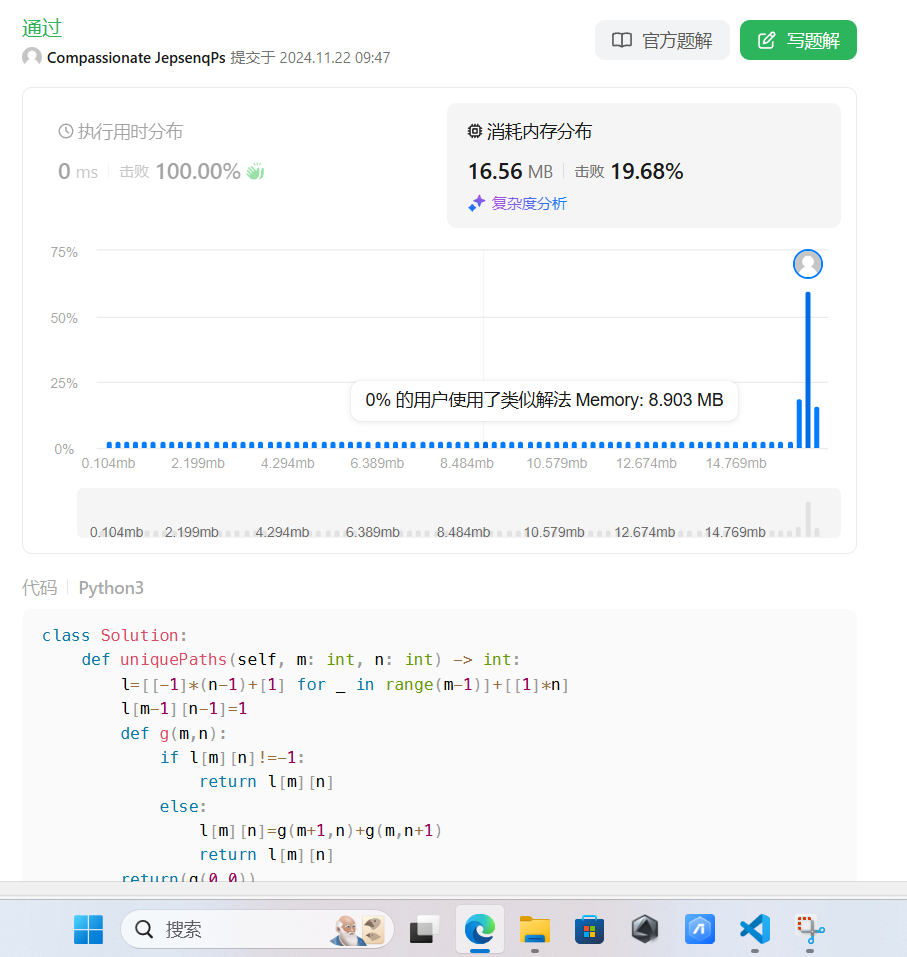
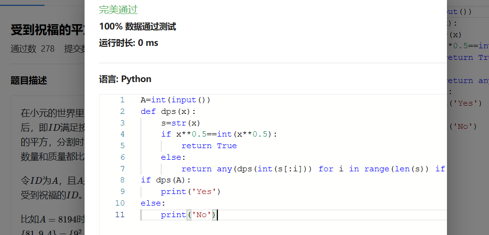

# Assignment #9: dfs, bfs, & dp

Updated 2107 GMT+8 Nov 19, 2024

2024 fall, Complied by <mark>王思远 物理学院</mark>


**说明：**

1）请把每个题目解题思路（可选），源码Python, 或者C++（已经在Codeforces/Openjudge上AC），截图（包含Accepted），填写到下面作业模版中（推荐使用 typora https://typoraio.cn ，或者用word）。AC 或者没有AC，都请标上每个题目大致花费时间。

2）提交时候先提交pdf文件，再把md或者doc文件上传到右侧“作业评论”。Canvas需要有同学清晰头像、提交文件有pdf、"作业评论"区有上传的md或者doc附件。

3）如果不能在截止前提交作业，请写明原因。


## 1. 题目

### 18160: 最大连通域面积

dfs similar, http://cs101.openjudge.cn/practice/18160

思路：


代码：

```python
num=int(input())
for _ in range(num):
    n,m=map(int,input().split())
    key=[]
    def fro(x):
        if x=='W':
            return True
        else:
            return False
    gen=0
    l=[[False]*(m+2)]
    for p in range(n):
        ll=[False]+list(map(fro,list(input())))+[False]
        #print(ll)
        gen+=ll.count(True)
        l.append(ll)
    l.append([False]*(m+2))
    #print(l)
    visited=set()
    c=[0]
    def dfs(x,y):
        if l[x][y] and (x,y) not in visited:
            visited.add((x,y))
            c[0]=c[0]+1
            return dfs(x-1,y),dfs(x+1,y),dfs(x,y-1),dfs(x,y+1),dfs(x+1,y+1),dfs(x+1,y-1),dfs(x-1,y-1),dfs(x-1,y+1)
    for i in range(1,n+1):
        for j in range(1,m+1):
            #print(i,j)
            if l[i][j] and (i,j) not in visited:
                dfs(i,j)
                key.append(c[0])
                c=[0]
    if key:
        print(max(key))
    else:
        print(0)
```


代码运行截图 <mark>（至少包含有"Accepted"）</mark>



### 19930: 寻宝

bfs, http://cs101.openjudge.cn/practice/19930

思路：


代码：

```python
from collections import deque

m,n=map(int,input().split())
def fro(x):
    return -int(x)
l=[[-2]*(n+2)]
for _ in range(m):
    ll=[-2]+list(map(fro,input().split()))+[-2]
    l.append(ll)
l.append([-2]*(n+2))
todolist=deque([(1,1)])
if l[1][1]==-1:
    print(0)
    kill=1
else:
    kill=0
#visited=[(0,0)]
c=0
k=0
while todolist and kill==0:
    todo=todolist.pop()
    lli=[(todo[0]+1,todo[1]),(todo[0]-1,todo[1]),(todo[0],todo[1]+1),(todo[0],todo[1]-1)]
    for i in lli:
        if l[i[0]][i[1]]==-1:
            print(l[todo[0]][todo[1]]+1)
            k=1
            break
        if l[i[0]][i[1]]==0:
            todolist.appendleft(i)
            #visited.append(i)
            l[i[0]][i[1]]=l[todo[0]][todo[1]]+1
if k==0 and kill==0:
    print('NO')
```


代码运行截图 ==（至少包含有"Accepted"）==



### 04123: 马走日

dfs, http://cs101.openjudge.cn/practice/04123

思路：


代码：

```python
T=int(input())
def dps(visited, n, m, x, y, con):
    if con + 1 == n * m:
        return 1
    else:
        allow = [(x + 1, y + 2), (x + 1, y - 2), (x - 1, y + 2), (x - 1, y - 2), (x + 2, y + 1), (x + 2, y - 1),
                 (x - 2, y + 1), (x - 2, y - 1)]
        return sum(dps(visited | {(x, y)}, n, m, i[0], i[1], con + 1) for i in allow if
                   i not in visited and 1 < i[0] < n + 2 and 1 < i[1] < m + 2)
for _ in range(T):
    n,m,x,y=map(int,input().split())
    print(dps(set(),n,m,x+2,y+2,0))
```


代码运行截图 <mark>（至少包含有"Accepted"）</mark>



### sy316: 矩阵最大权值路径

dfs, https://sunnywhy.com/sfbj/8/1/316

思路：


代码：

```python
n,m=map(int,input().split())
l=[[-1]*(m+2)]+[[-1]+list(map(int,input().split()))+[-1] for _ in range(n)]+[[-1]*(m+2)]
def dps(visited,x, y,con):
    if x==n and y==m:
        return [con+l[x][y]]+visited+[(n,m)]
    else:
        neighbor=[(x+1,y),(x-1,y),(x,y+1),(x,y-1)]
        return max((dps(visited+[(x,y)],i[0],i[1],con+l[x][y]) for i in neighbor if i not in visited and 0<i[0]<n+1 and 0<i[1]<m+1),key=lambda x: x[0],default=[-float('inf'),[]])
for i in dps([],1,1,0)[1:]:
    print(' '.join(map(str,i)))
```


代码运行截图 <mark>（至少包含有"Accepted"）</mark>



### LeetCode62.不同路径

dp, https://leetcode.cn/problems/unique-paths/

思路：


代码：

```python
class Solution:
    def uniquePaths(self, m: int, n: int) -> int:
        l=[[-1]*(n-1)+[1] for _ in range(m-1)]+[[1]*n]
        l[m-1][n-1]=1
        def g(m,n):
            if l[m][n]!=-1:
                return l[m][n]
            else:
                l[m][n]=g(m+1,n)+g(m,n+1)
                return l[m][n]
        return(g(0,0))
```


代码运行截图 <mark>（至少包含有"Accepted"）</mark>



### sy358: 受到祝福的平方

dfs, dp, https://sunnywhy.com/sfbj/8/3/539

思路：


代码：

```python
A=int(input())
def dps(x):
    s=str(x)
    if x**0.5==int(x**0.5):
        return True
    else:
        return any(dps(int(s[:i])) for i in range(len(s)) if int(s[i:])**0.5==int(int(s[i:])**0.5) and int(s[i:])!=0)
if dps(A):
    print('Yes')
else:
    print('No')
```


代码运行截图 <mark>（至少包含有"Accepted"）</mark>



## 2. 学习总结和收获

<mark>如果作业题目简单，有否额外练习题目，比如：OJ“计概2024fall每日选做”、CF、LeetCode、洛谷等网站题目。</mark>
在做每日选做,能感觉到有提升,现在看之前的题感觉轻松很多,拿到不是很难的题思路更清晰了,看题解总能收获一些小用法和小技巧,遇到的多了自己也逐渐会用一些。


