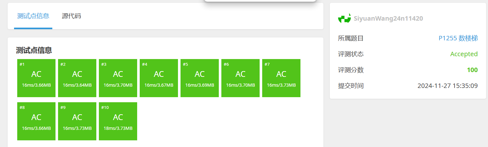
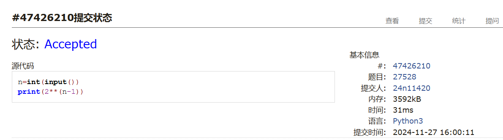
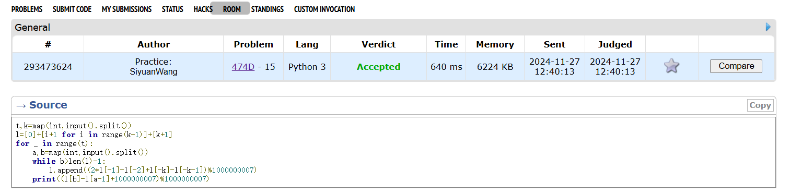
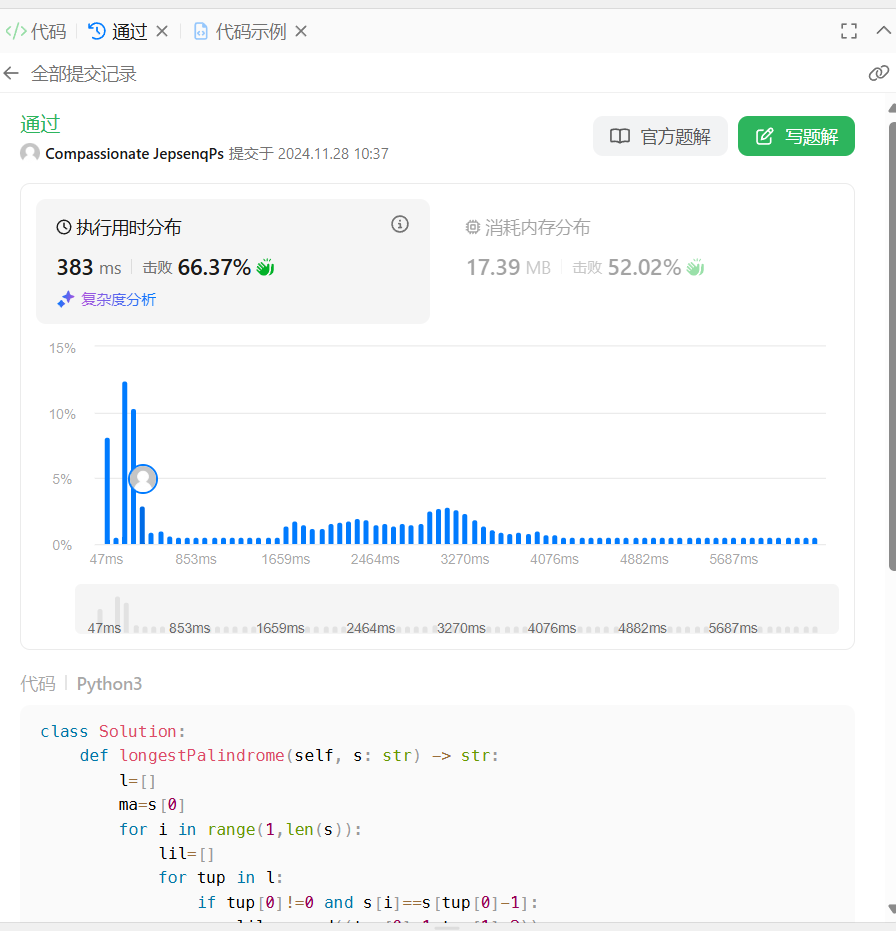
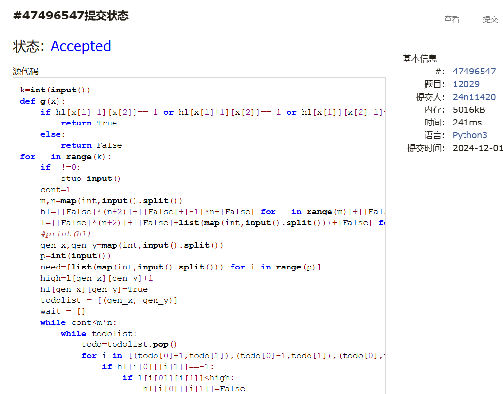
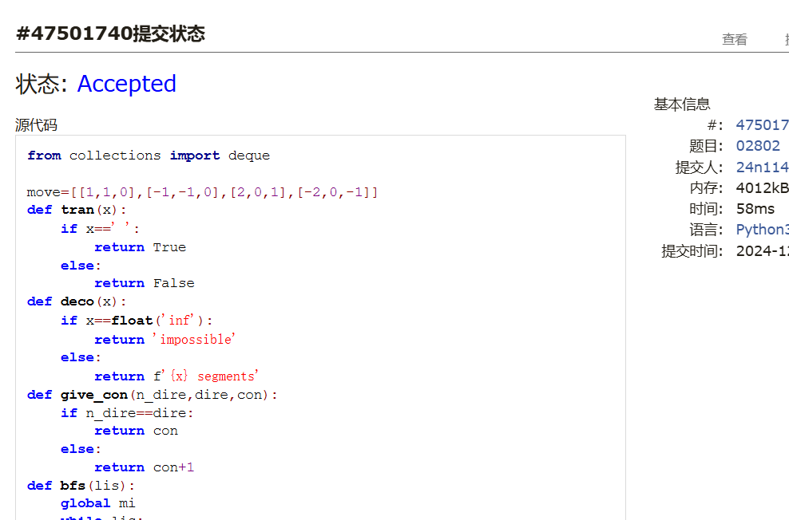

# Assignment #10: dp & bfs

Updated 2 GMT+8 Nov 25, 2024

2024 fall, Complied by <mark>王思远、物理学院</mark>


**说明：**

1）请把每个题目解题思路（可选），源码Python, 或者C++（已经在Codeforces/Openjudge上AC），截图（包含Accepted），填写到下面作业模版中（推荐使用 typora https://typoraio.cn ，或者用word）。AC 或者没有AC，都请标上每个题目大致花费时间。

2）提交时候先提交pdf文件，再把md或者doc文件上传到右侧“作业评论”。Canvas需要有同学清晰头像、提交文件有pdf、"作业评论"区有上传的md或者doc附件。

3）如果不能在截止前提交作业，请写明原因。


## 1. 题目

### LuoguP1255 数楼梯

dp, bfs, https://www.luogu.com.cn/problem/P1255

思路：


代码：

```python
n=int(input())
a,b=1,2
c=2
while c<n:
    a,b=b,a+b
    c+=1
if n==1:
    print(1)
else:
    print(b)
```


代码运行截图 <mark>（至少包含有"Accepted"）</mark>



### 27528: 跳台阶

dp, http://cs101.openjudge.cn/practice/27528/

思路：


代码：

```python
n=int(input())
print(2**(n-1))
```


代码运行截图 ==（至少包含有"Accepted"）==



### 474D. Flowers

dp, https://codeforces.com/problemset/problem/474/D

思路：


代码：

```python
t,k=map(int,input().split())
l=[0]+[i+1 for i in range(k-1)]+[k+1]
for _ in range(t):
    a,b=map(int,input().split())
    while b>len(l)-1:
        l.append((2*l[-1]-l[-2]+l[-k]-l[-k-1])%1000000007)
    print((l[b]-l[a-1]+1000000007)%1000000007)
```


代码运行截图 <mark>（至少包含有"Accepted"）</mark>



### LeetCode5.最长回文子串

dp, two pointers, string, https://leetcode.cn/problems/longest-palindromic-substring/

思路：


代码：

```python
class Solution:
    def longestPalindrome(self, s: str) -> str:
        l=[]
        ma=s[0]
        for i in range(1,len(s)):
            lil=[]
            for tup in l:
                if tup[0]!=0 and s[i]==s[tup[0]-1]:
                    lil.append((tup[0]-1,tup[1]+2))
                else:
                    ma=max(ma,s[tup[0]:tup[0]+tup[1]],key=lambda x:len(x))
            if s[i-1]==s[i]:
                lil.append((i-1,2))
            if i!=1 and s[i]==s[i-2]:
                lil.append((i-2,3))
            l=lil[:]
        for tup in l:
            ma=max(ma,s[tup[0]:tup[0]+tup[1]+1],key=lambda x:len(x))
        return(ma)
```


代码运行截图 <mark>（至少包含有"Accepted"）</mark>



### 12029: 水淹七军

bfs, dfs, http://cs101.openjudge.cn/practice/12029/

思路：


代码：

```python
k=int(input())
def g(x):
    if hl[x[1]-1][x[2]]==-1 or hl[x[1]+1][x[2]]==-1 or hl[x[1]][x[2]-1]==-1 or hl[x[1]][x[2]+1]==-1:
        return True
    else:
        return False
for _ in range(k):
    if _!=0:
        stup=input()
    cont=1
    m,n=map(int,input().split())
    hl=[[False]*(n+2)]+[[False]+[-1]*n+[False] for _ in range(m)]+[[False]*(n+2)]
    l=[[False]*(n+2)]+[[False]+list(map(int,input().split()))+[False] for i in range(m)]+[[False]*(n+2)]
    #print(hl)
    gen_x,gen_y=map(int,input().split())
    p=int(input())
    need=[list(map(int,input().split())) for i in range(p)]
    high=l[gen_x][gen_y]+1
    hl[gen_x][gen_y]=True
    todolist = [(gen_x, gen_y)]
    wait = []
    while cont<m*n:
        while todolist:
            todo=todolist.pop()
            for i in [(todo[0]+1,todo[1]),(todo[0]-1,todo[1]),(todo[0],todo[1]+1),(todo[0],todo[1]-1)]:
                if hl[i[0]][i[1]]==-1:
                    if l[i[0]][i[1]]<high:
                        hl[i[0]][i[1]]=False
                        todolist.append(i)
                    else:
                        hl[i[0]][i[1]]=True
                        wait.append((l[i[0]][i[1]],i[0],i[1]))
                    cont=cont+1
        wait=[i for i in wait if g(i)]
        wait.sort(reverse=True,key=lambda x: x[0])
        if len(wait)>0:
            high=wait[-1][0]+1
            todolist=[(wait[-1][1],wait[-1][2])]
            wait.pop()
    if any(hl[i[0]][i[1]] for i in need):
        print('Yes')
    else:
        print('No')
```


代码运行截图 <mark>（至少包含有"Accepted"）</mark>



### 02802: 小游戏

bfs, http://cs101.openjudge.cn/practice/02802/

思路：


代码：

```python
from collections import deque

move=[[1,1,0],[-1,-1,0],[2,0,1],[-2,0,-1]]
def tran(x):
    if x==' ':
        return True
    else:
        return False
def deco(x):
    if x==float('inf'):
        return 'impossible'
    else:
        return f'{x} segments'
def give_con(n_dire,dire,con):
    if n_dire==dire:
        return con
    else:
        return con+1
def bfs(lis):
    global mi
    while lis:
        todo=lis.popleft()
        dire, con, x1, y1, x2, y2, visited=todo
        #print(x1,y1,x2,y2)
        if x1==x2 and y1==y2:
            mi=min(mi,con)
        elif con>=mi:
            continue
        if l[x1][y1] or dire==0:
            visited.add((x1,y1))
            lis.extend([(i[0],give_con(i[0],dire,con),x1+i[1],y1+i[2],x2,y2,visited) for i in move if (x1+i[1],y1+i[2]) not in visited and i[0]!=-dire])
    return mi
Board=0
while True:
    Board=Board+1
    w,h=map(int,input().split())
    if w==h==0:
        break
    l=[[False]*(w+4)]+[[False]+[True]*(w+2)+[False]]+[[False,True]+list(map(tran,input()))+[True,False] for _ in range(h)]+[[False]+[True]*(w+2)+[False]]+[[False]*(w+4)]
    #print(l)
    Pair=0
    print(f'Board #{Board}:')
    while True:
        Pair=Pair+1
        x1,y1,x2,y2=map(int,input().split())
        if x1==x2==y1==y2==0:
            break
        mi = float('inf')
        lis=deque([(0,0,1+y1,1+x1,1+y2,1+x2,set())])
        print(f'Pair {Pair}: {deco(bfs(lis))}.')
    print()
```


代码运行截图 <mark>（至少包含有"Accepted"）</mark>



## 2. 学习总结和收获

<mark>如果作业题目简单，有否额外练习题目，比如：OJ“计概2024fall每日选做”、CF、LeetCode、洛谷等网站题目。</mark>
水淹七军这个数据真难受，我上面写的没有一次读入所有数据，一行一行读也能过，但是需要每两组之间读一个空行进去。我一开始直接做的，发现过不了，然后看了说要一次性读完数据。改完之后想知道输入数据到底是什么样的，然后往代码里插条件死循环试了好多遍发现两组之间好像有一个空行（所以当天一个人提交了50个左右错代码），题目里面有个“第M+4行至M+P+4行”，但是数出来好像是“至M+P+3行”，当时没多想，结果输入数据也多一行。


