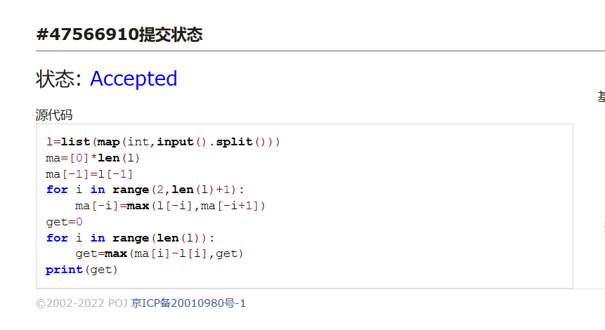
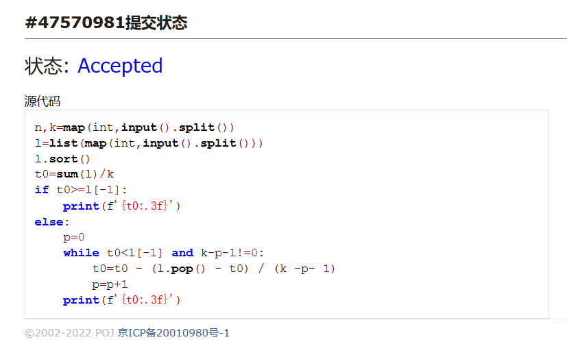
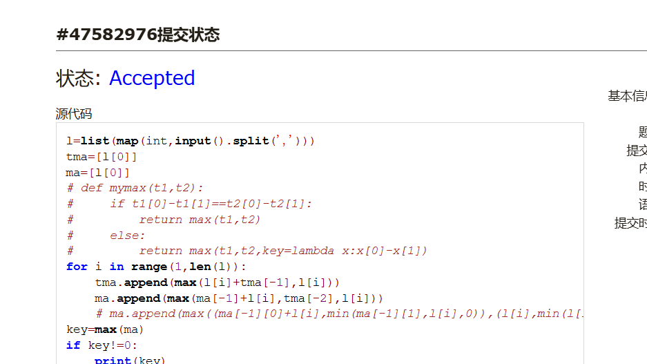
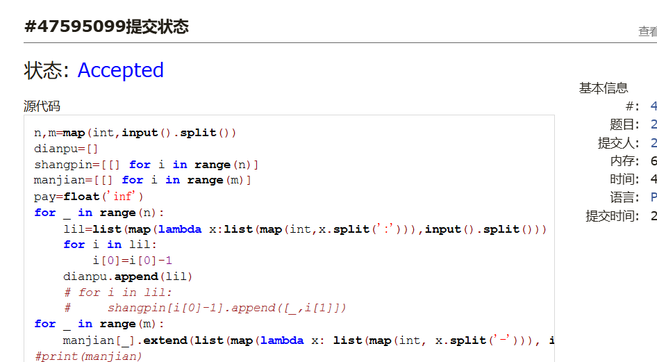
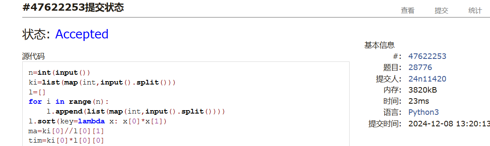

# Assignment #B: Dec Mock Exam大雪前一天

Updated 1649 GMT+8 Dec 5, 2024

2024 fall, Complied by <mark>王思远、物理学院</mark>


**说明：**

1）⽉考： AC2<mark>（请改为同学的通过数）</mark> 。考试题⽬都在“题库（包括计概、数算题目）”⾥⾯，按照数字题号能找到，可以重新提交。作业中提交⾃⼰最满意版本的代码和截图。

2）请把每个题目解题思路（可选），源码Python, 或者C++（已经在Codeforces/Openjudge上AC），截图（包含Accepted），填写到下面作业模版中（推荐使用 typora https://typoraio.cn ，或者用word）。AC 或者没有AC，都请标上每个题目大致花费时间。

3）提交时候先提交pdf文件，再把md或者doc文件上传到右侧“作业评论”。Canvas需要有同学清晰头像、提交文件有pdf、"作业评论"区有上传的md或者doc附件。

4）如果不能在截止前提交作业，请写明原因。


## 1. 题目

### E22548: 机智的股民老张

http://cs101.openjudge.cn/practice/22548/

思路：


代码：

```python
l=list(map(int,input().split()))
ma=[0]*len(l)
ma[-1]=l[-1]
for i in range(2,len(l)+1):
    ma[-i]=max(l[-i],ma[-i+1])
get=0
for i in range(len(l)):
    get=max(ma[i]-l[i],get)
print(get)
```


代码运行截图 <mark>（至少包含有"Accepted"）</mark>



### M28701: 炸鸡排

greedy, http://cs101.openjudge.cn/practice/28701/

思路：


代码：

```python
n,k=map(int,input().split())
l=list(map(int,input().split()))
l.sort()
t0=sum(l)/k
if t0>=l[-1]:
    print(f'{t0:.3f}')
else:
    p=0
    while t0<l[-1] and k-p-1!=0:
        t0=t0 - (l.pop() - t0) / (k -p- 1)
        p=p+1
    print(f'{t0:.3f}')
```


代码运行截图 ==（至少包含有"Accepted"）==



### M20744: 土豪购物

dp, http://cs101.openjudge.cn/practice/20744/

思路：


代码：

```python
l=list(map(int,input().split(',')))
tma=[l[0]]
ma=[l[0]]
# def mymax(t1,t2):
#     if t1[0]-t1[1]==t2[0]-t2[1]:
#         return max(t1,t2)
#     else:
#         return max(t1,t2,key=lambda x:x[0]-x[1])
for i in range(1,len(l)):
    tma.append(max(l[i]+tma[-1],l[i]))
    ma.append(max(ma[-1]+l[i],tma[-2],l[i]))
    # ma.append(max((ma[-1][0]+l[i],min(ma[-1][1],l[i],0)),(l[i],min(l[i],0)),key=lambda x:x[0]-x[1]))
key=max(ma)
if key!=0:
    print(key)
else:
    print(max(l))
```


代码运行截图 <mark>（至少包含有"Accepted"）</mark>



### T25561: 2022决战双十一

brute force, dfs, http://cs101.openjudge.cn/practice/25561/

思路：


代码：

```python
n,m=map(int,input().split())
dianpu=[]
shangpin=[[] for i in range(n)]
manjian=[[] for i in range(m)]
pay=float('inf')
for _ in range(n):
    lil=list(map(lambda x:list(map(int,x.split(':'))),input().split()))
    for i in lil:
        i[0]=i[0]-1
    dianpu.append(lil)
    # for i in lil:
    #     shangpin[i[0]-1].append([_,i[1]])
for _ in range(m):
    manjian[_].extend(list(map(lambda x: list(map(int, x.split('-'))), input().split())))
#print(manjian)
def myadd(l,t):
    pal=[i[:] for i in l]
    for i in pal:
        if i[0]==t[0]:
            i[1]=i[1]+t[1]
            break
    return pal
def cut(lifo):
    cu=0
    for i in range(len(lifo)):
        licu=0
        for j in manjian[i]:
            if lifo[i][1]>=j[0]:
                licu=max(licu,j[1])
        cu=cu+licu
    su=sum(i[1] for i in lifo)
    cu=cu+50*(su//300)
    #print(lifo)
    return su-cu
fo=[[[i,0] for i in range(m)]]
# for l in fo:
#     print(l)
for tl in dianpu:
    fo=[myadd(l,t) for l in fo for t in tl]
#print(fo)
for i in fo:
    pay=min(cut(i),pay)
print(pay)
```


代码运行截图 <mark>（至少包含有"Accepted"）</mark>



### T20741: 两座孤岛最短距离

dfs, bfs, http://cs101.openjudge.cn/practice/20741/

思路：


代码：

```python
from collections import deque

n=int(input())
l=[]
for _ in range(n):
    l.append(list(map(int,list(input()))))
for i in range(n):
    start=0
    for j in range(n):
        if l[i][j]==1:
            start=(i,j)
            break
    if start!=0:
        break
tdl=deque([[start,0]])
# print(tdl[0])
visited=set([start])
move=[(0,1),(0,-1),(1,0),(-1,0)]
while True:
    td=tdl.pop()
    if td[1]!=0 and l[td[0][0]][td[0][1]]==1:
        print(td[1])
        break
    for i in move:
        vis=(td[0][0]+i[0],td[0][1]+i[1])
        if 0<=vis[0]<n and 0<=vis[1]<n and vis not in visited:
            visited.add(vis)
            if l[vis[0]][vis[1]]==1:
                tdl.append([vis,td[1]])
            else:
                tdl.appendleft([vis,td[1]+1])
```


代码运行截图 <mark>（至少包含有"Accepted"）</mark>


### T28776: 国王游戏

greedy, http://cs101.openjudge.cn/practice/28776

思路：


代码：

```python
n=int(input())
ki=list(map(int,input().split()))
l=[]
for i in range(n):
    l.append(list(map(int,input().split())))
l.sort(key=lambda x: x[0]*x[1])
ma=ki[0]//l[0][1]
tim=ki[0]*l[0][0]
for i in range(1,n):
    ma=max(tim//l[i][1],ma)
    tim=tim*l[i][0]
print(ma)
```


代码运行截图 <mark>（至少包含有"Accepted"）</mark>



## 2. 学习总结和收获

<mark>如果作业题目简单，有否额外练习题目，比如：OJ“计概2024fall每日选做”、CF、LeetCode、洛谷等网站题目。</mark>
月考时没有数据范围的题不敢直接写，不知道多大复杂度能过，写之前就要想很多，AC之后才发现有时候考虑的有点多余。希望正式考试明确数据范围。


