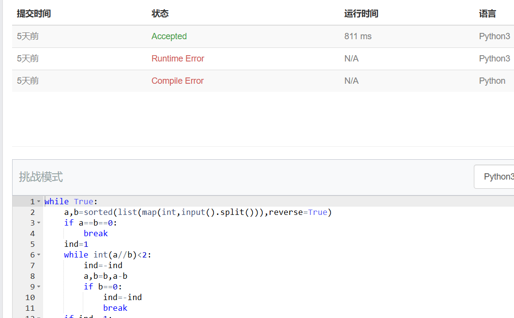
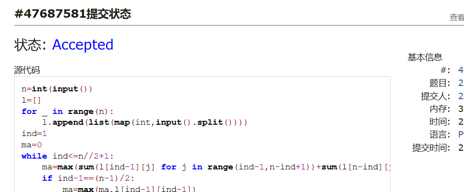
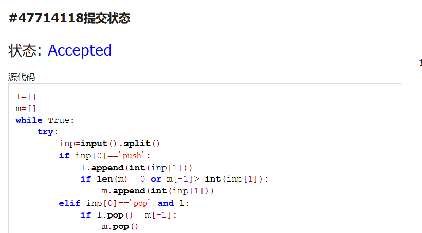
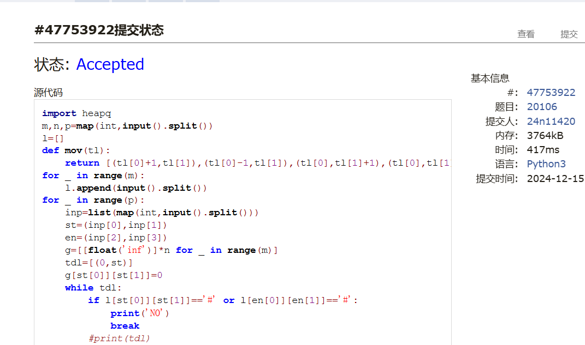

# Assignment #C: 五味杂陈 

Updated 1148 GMT+8 Dec 10, 2024

2024 fall, Complied by <mark>同学的姓名、院系</mark>


**说明：**

1）请把每个题目解题思路（可选），源码Python, 或者C++（已经在Codeforces/Openjudge上AC），截图（包含Accepted），填写到下面作业模版中（推荐使用 typora https://typoraio.cn ，或者用word）。AC 或者没有AC，都请标上每个题目大致花费时间。

2）提交时候先提交pdf文件，再把md或者doc文件上传到右侧“作业评论”。Canvas需要有同学清晰头像、提交文件有pdf、"作业评论"区有上传的md或者doc附件。

3）如果不能在截止前提交作业，请写明原因。


## 1. 题目

### 1115. 取石子游戏

dfs, https://www.acwing.com/problem/content/description/1117/

思路：


代码：

```python
while True:
    a,b=sorted(list(map(int,input().split())),reverse=True)
    if a==b==0:
        break
    ind=1
    while int(a//b)<2:
        ind=-ind
        a,b=b,a-b
        if b==0:
            ind=-ind
            break
    if ind==1:
        print('win')
    else:
        print('lose')

```


代码运行截图 <mark>（至少包含有"Accepted"）</mark>



### 25570: 洋葱

Matrices, http://cs101.openjudge.cn/practice/25570

思路：


代码：

```python
n=int(input())
l=[]
for _ in range(n):
    l.append(list(map(int,input().split())))
ind=1
ma=0
while ind<=n//2+1:
    ma=max(sum(l[ind-1][j] for j in range(ind-1,n-ind+1))+sum(l[n-ind][j] for j in range(ind-1,n-ind+1))+sum(l[i][ind-1] for i in range(ind-1,n-ind+1))+sum(l[i][n-ind] for i in range(ind-1,n-ind+1))-sum(l[i][j] for i in (ind-1,n-ind) for j in (ind-1,n-ind)),ma)
    if ind-1==(n-1)/2:
        ma=max(ma,l[ind-1][ind-1])
    ind=ind+1
print(ma)
```


代码运行截图 ==（至少包含有"Accepted"）==



### 1526C1. Potions(Easy Version)

greedy, dp, data structures, brute force, *1500, https://codeforces.com/problemset/problem/1526/C1

思路：


代码：

```python
n=int(input())
l=list(map(int,input().split()))
se= {0:0}
for i in l:
    if i>=0:
        for j in list(zip(se.keys(),se.values())):
            se[j[0]+1]=j[1]+i
    else:
        for j in list(zip(se.keys(),se.values())):
            if j[1]+i>=0:
                if j[0]+1 in se:
                    se[j[0]+1]=max(j[1]+i,se[j[0]+1])
                else:
                    se[j[0]+1]=j[1]+i
print(max(se.keys()))
```


代码运行截图 <mark>（至少包含有"Accepted"）</mark>


### 22067: 快速堆猪

辅助栈，http://cs101.openjudge.cn/practice/22067/

思路：


代码：

```python
l=[]
m=[]
while True:
    try:
        inp=input().split()
        if inp[0]=='push':
            l.append(int(inp[1]))
            if len(m)==0 or m[-1]>=int(inp[1]):
                m.append(int(inp[1]))
        elif inp[0]=='pop' and l:
            if l.pop()==m[-1]:
                m.pop()
        elif inp[0]=='min' and l:
            print(m[-1])
    except EOFError:
        break
```


代码运行截图 <mark>（至少包含有"Accepted"）</mark>



### 20106: 走山路

Dijkstra, http://cs101.openjudge.cn/practice/20106/

思路：


代码：

```python
import heapq
m,n,p=map(int,input().split())
l=[]
def mov(tl):
    return [(tl[0]+1,tl[1]),(tl[0]-1,tl[1]),(tl[0],tl[1]+1),(tl[0],tl[1]-1)]
for _ in range(m):
    l.append(input().split())
for _ in range(p):
    inp=list(map(int,input().split()))
    st=(inp[0],inp[1])
    en=(inp[2],inp[3])
    g=[[float('inf')]*n for _ in range(m)]
    tdl=[(0,st)]
    g[st[0]][st[1]]=0
    while tdl:
        if l[st[0]][st[1]]=='#' or l[en[0]][en[1]]=='#':
            print('NO')
            break
        #print(tdl)
        i=heapq.heappop(tdl)[1]
        if i==en:
            print(g[i[0]][i[1]])
            break
        for t in mov(i):
            if 0<=t[0]<m and 0<=t[1]<n and l[t[0]][t[1]]!='#' and g[t[0]][t[1]]>g[i[0]][i[1]]+abs(int(l[i[0]][i[1]])-int(l[t[0]][t[1]])):
                g[t[0]][t[1]]=g[i[0]][i[1]] + abs(int(l[i[0]][i[1]]) - int(l[t[0]][t[1]]))
                heapq.heappush(tdl,(g[t[0]][t[1]],t))
    else:
        print('NO')
```


代码运行截图 <mark>（至少包含有"Accepted"）</mark>




### 04129: 变换的迷宫

bfs, http://cs101.openjudge.cn/practice/04129/

思路：


代码：

```python
from collections import deque

T=int(input())
for _ in range(T):
    r,c,k=map(int,input().split())
    l=[]
    for i in range(r):
        lil=list(input())
        if 'S' in lil:
            st=(i,lil.index('S'))
        l.append(lil)
    waf=deque([(0,st)])
    visited={(0,st)}
    def g(t):
        if t[0]==0:
            return True
        elif l[t[1][0]][t[1][1]]!='#':
            return True
        else:
            return False
    kill=0
    while waf:
        todo=waf.pop()
        for i in [(todo[1][0]+1,todo[1][1]),(todo[1][0]-1,todo[1][1]),(todo[1][0],todo[1][1]+1),(todo[1][0],todo[1][1]-1)]:
            if ((todo[0]+1)%k,i) not in visited and 0<=i[0]<r and 0<=i[1]<c and g(((todo[0]+1)%k,i)):
                visited.add(((todo[0]+1)%k,i))
                waf.appendleft((todo[0]+1,i))
                if l[i[0]][i[1]]=='E':
                    print(todo[0]+1)
                    kill=1
                    break
        if kill==1:
            break
    else:
        print('Oop!')
```


代码运行截图 <mark>（至少包含有"Accepted"）</mark>


## 2. 学习总结和收获

<mark>如果作业题目简单，有否额外练习题目，比如：OJ“计概2024fall每日选做”、CF、LeetCode、洛谷等网站题目。</mark>
洋葱一开始暴力写的，看了题解感觉有收获。感觉可以改进我之前写的旋转矩阵。


