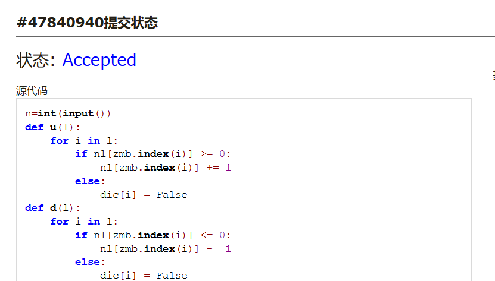
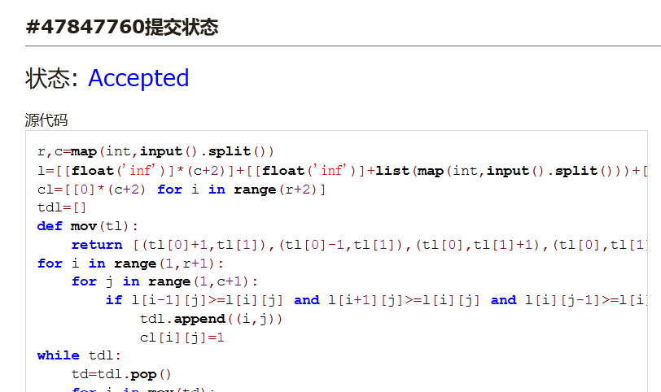
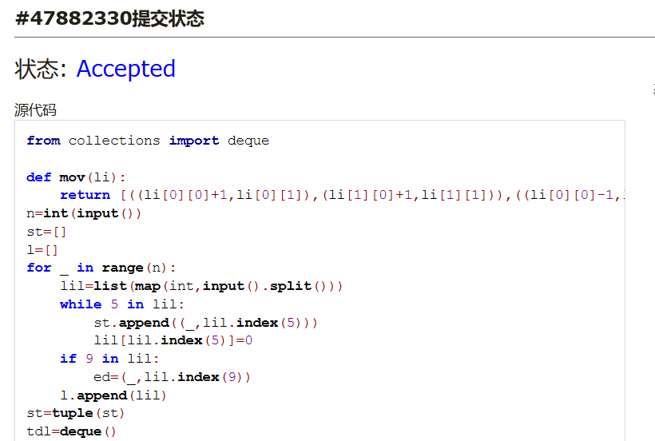
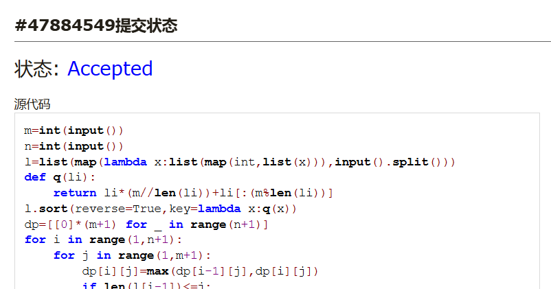
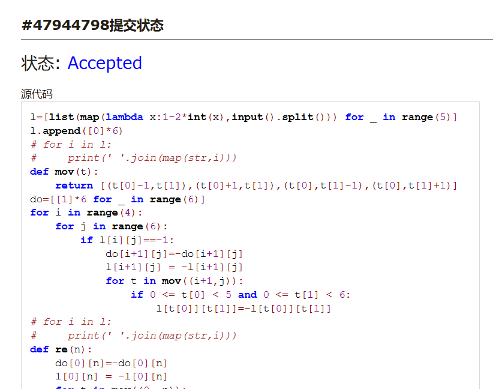
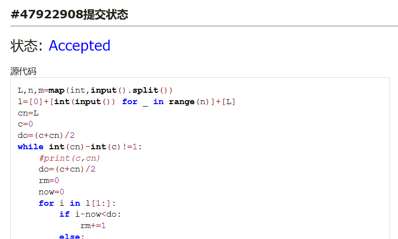

# Assignment #D: 十全十美 

Updated 1254 GMT+8 Dec 17, 2024

2024 fall, Complied by <mark>王思远、院系</mark>


**说明：**

1）请把每个题目解题思路（可选），源码Python, 或者C++（已经在Codeforces/Openjudge上AC），截图（包含Accepted），填写到下面作业模版中（推荐使用 typora https://typoraio.cn ，或者用word）。AC 或者没有AC，都请标上每个题目大致花费时间。

2）提交时候先提交pdf文件，再把md或者doc文件上传到右侧“作业评论”。Canvas需要有同学清晰头像、提交文件有pdf、"作业评论"区有上传的md或者doc附件。

3）如果不能在截止前提交作业，请写明原因。


## 1. 题目

### 02692: 假币问题

brute force, http://cs101.openjudge.cn/practice/02692

思路：


代码：

```python
n=int(input())
def u(l):
    for i in l:
        if nl[zmb.index(i)] >= 0:
            nl[zmb.index(i)] += 1
        else:
            dic[i] = False
def d(l):
    for i in l:
        if nl[zmb.index(i)] <= 0:
            nl[zmb.index(i)] -= 1
        else:
            dic[i] = False
zmb=['A','B','C','D','E','F','G','H','I','J','K','L']
for _ in range(n):
    dic={key: True for key in zmb}
    nl=[0]*12
    for num in range(3):
        inl=input().split()
        zuo=list(inl[0])
        you=list(inl[1])
        if inl[2]=='even':
            for i in zuo+you:
                dic[i]=False
        elif inl[2]=='up':
            d(zuo)
            u(you)
        elif inl[2]=='down':
            u(zuo)
            d(you)
        #print(dic,nl)
    ma=0
    for i in range(12):
        if dic[zmb[i]] and abs(nl[i])>abs(ma):
            ma=nl[i]
            ind=i
    if ma<0:
        print(f'{zmb[ind]} is the counterfeit coin and it is heavy.')
    elif ma>0:
        print(f'{zmb[ind]} is the counterfeit coin and it is light.')
```


代码运行截图 <mark>（至少包含有"Accepted"）</mark>



### 01088: 滑雪

dp, dfs similar, http://cs101.openjudge.cn/practice/01088

思路：


代码：

```python
r,c=map(int,input().split())
l=[[float('inf')]*(c+2)]+[[float('inf')]+list(map(int,input().split()))+[float('inf')] for _ in range(r)]+[[float('inf')]*(c+2)]
cl=[[0]*(c+2) for i in range(r+2)]
tdl=[]
def mov(tl):
    return [(tl[0]+1,tl[1]),(tl[0]-1,tl[1]),(tl[0],tl[1]+1),(tl[0],tl[1]-1)]
for i in range(1,r+1):
    for j in range(1,c+1):
        if l[i-1][j]>=l[i][j] and l[i+1][j]>=l[i][j] and l[i][j-1]>=l[i][j] and l[i][j+1]>=l[i][j]:
            tdl.append((i,j))
            cl[i][j]=1
while tdl:
    td=tdl.pop()
    for i in mov(td):
        if 0<i[0]<r+1 and 0<i[1]<c+1 and l[i[0]][i[1]]>l[td[0]][td[1]] and 1+cl[td[0]][td[1]]>cl[i[0]][i[1]]:
            cl[i[0]][i[1]]=1+cl[td[0]][td[1]]
            tdl.append(i)
ma=0
for i in cl:
    ma=max(ma,max(i))
print(max(ma,1))
#print(cl)
```


代码运行截图 ==（至少包含有"Accepted"）==



### 25572: 螃蟹采蘑菇

bfs, dfs, http://cs101.openjudge.cn/practice/25572/

思路：


代码：

```python
from collections import deque

def mov(li):
    return [((li[0][0]+1,li[0][1]),(li[1][0]+1,li[1][1])),((li[0][0]-1,li[0][1]),(li[1][0]-1,li[1][1])),((li[0][0],li[0][1]+1),(li[1][0],li[1][1]+1)),((li[0][0],li[0][1]-1),(li[1][0],li[1][1]-1))]
n=int(input())
st=[]
l=[]
for _ in range(n):
    lil=list(map(int,input().split()))
    while 5 in lil:
        st.append((_,lil.index(5)))
        lil[lil.index(5)]=0
    if 9 in lil:
        ed=(_,lil.index(9))
    l.append(lil)
st=tuple(st)
tdl=deque()
tdl.append(st)
visited={st}
#print(visited)
ki=0
while tdl:
    td=tdl.pop()
    for i in mov(td):
        if i not in visited and 0<=i[0][0]<n and 0<=i[0][1]<n and 0<=i[1][0]<n and 0<=i[1][1]<n and l[i[0][0]][i[0][1]]!=1 and l[i[1][0]][i[1][1]]!=1:
            tdl.appendleft(i)
            visited.add(i)
            if i[0] == ed or i[1] == ed:
                print('yes')
                ki = 1
                break
    if ki==1:
        break
else:
    print('no')
```


代码运行截图 <mark>（至少包含有"Accepted"）</mark>



### 27373: 最大整数

dp, http://cs101.openjudge.cn/practice/27373/

思路：


代码：

```python
m=int(input())
n=int(input())
l=list(map(lambda x:list(map(int,list(x))),input().split()))
def q(li):
    return li*(m//len(li))+li[:(m%len(li))]
l.sort(reverse=True,key=lambda x:q(x))
dp=[[0]*(m+1) for _ in range(n+1)]
for i in range(1,n+1):
    for j in range(1,m+1):
        dp[i][j]=max(dp[i-1][j],dp[i][j])
        if len(l[i-1])<=j:
            dp[i][j-len(l[i-1])]=max(dp[i-1][j]*(10**len(l[i-1]))+int(''.join(map(str,l[i-1]))),dp[i-1][j-len(l[i-1])])
print(max(dp[-1]))
```


代码运行截图 <mark>（至少包含有"Accepted"）</mark>



### 02811: 熄灯问题

brute force, http://cs101.openjudge.cn/practice/02811

思路：


代码：

```python
l=[list(map(lambda x:1-2*int(x),input().split())) for _ in range(5)]
l.append([0]*6)
# for i in l:
#     print(' '.join(map(str,i)))
def mov(t):
    return [(t[0]-1,t[1]),(t[0]+1,t[1]),(t[0],t[1]-1),(t[0],t[1]+1)]
do=[[1]*6 for _ in range(6)]
for i in range(4):
    for j in range(6):
        if l[i][j]==-1:
            do[i+1][j]=-do[i+1][j]
            l[i+1][j] = -l[i+1][j]
            for t in mov((i+1,j)):
                if 0 <= t[0] < 5 and 0 <= t[1] < 6:
                    l[t[0]][t[1]]=-l[t[0]][t[1]]
# for i in l:
#     print(' '.join(map(str,i)))
def re(n):
    do[0][n]=-do[0][n]
    l[0][n] = -l[0][n]
    for t in mov((0, n)):
        if 0 <= t[0] < 5 and 0 <= t[1] < 6:
            l[t[0]][t[1]] = -l[t[0]][t[1]]
if l[-2][0]==-1:
    re(1),re(0)
if l[-2][1]==-1:
    re(0),re(1),re(2)
if l[-2][2]==-1:
    re(1),re(2),re(3)
if l[-2][3]==-1:
    re(4),re(2),re(3)
if l[-2][-2]==-1:
    re(3),re(4),re(5)
if l[-2][-1]==-1:
    re(4),re(5)
# for i in l:
#     print(' '.join(map(str,i)))
for i in range(4):
    for j in range(6):
        if l[i][j]==-1:
            do[i+1][j]=-do[i+1][j]
            l[i+1][j] = -l[i+1][j]
            for t in mov((i+1,j)):
                if 0 <= t[0] < 5 and 0 <= t[1] < 6:
                    l[t[0]][t[1]]=-l[t[0]][t[1]]
for i in do[:-1]:
    print(' '.join(map(lambda x:str((1-x)//2),i)))
# for i in l:
#     print(' '.join(map(str,i)))
```


代码运行截图 <mark>（至少包含有"Accepted"）</mark>



### 08210: 河中跳房子

binary search, greedy, http://cs101.openjudge.cn/practice/08210/

思路：


代码：

```python
L,n,m=map(int,input().split())
l=[0]+[int(input()) for _ in range(n)]+[L]
cn=L
c=0
do=(c+cn)/2
while int(cn)-int(c)!=1:
    #print(c,cn)
    do=(c+cn)/2
    rm=0
    now=0
    for i in l[1:]:
        if i-now<do:
            rm+=1
        else:
            now=i
        if rm>m:
            cn=do
            break
    else:
        c=do
print(int(cn))
```


代码运行截图 <mark>（至少包含有"Accepted"）</mark>



## 2. 学习总结和收获

<mark>如果作业题目简单，有否额外练习题目，比如：OJ“计概2024fall每日选做”、CF、LeetCode、洛谷等网站题目。</mark>
马上机考了有点紧张，最近一直在刷题，但是越到期末越没信心。


