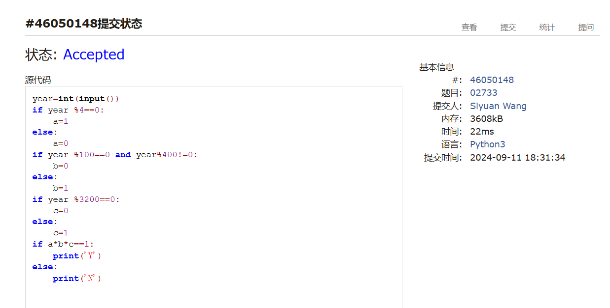
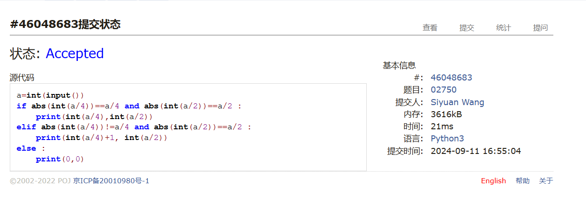
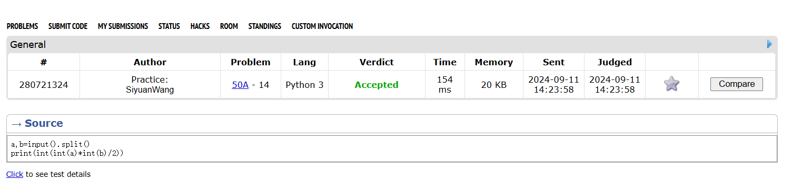
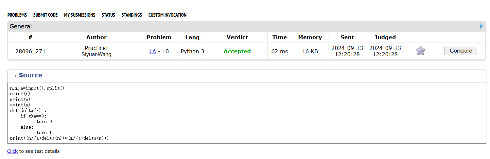
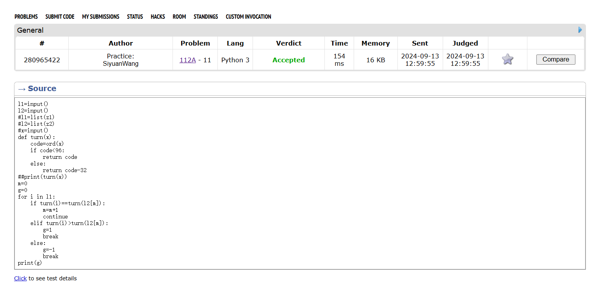
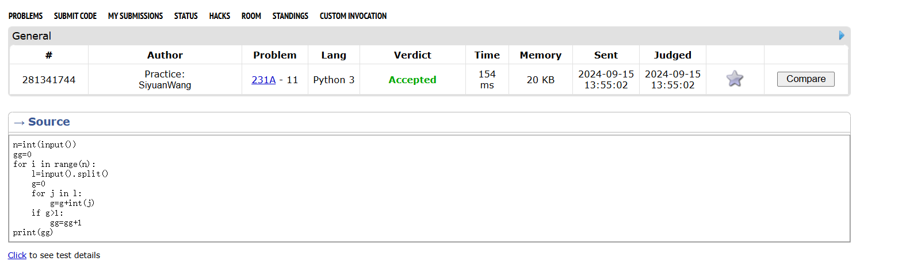

# Assignment #1: 自主学习

Updated 0110 GMT+8 Sep 10, 2024

2024 fall, Complied by ==同学的姓名、院系==


**说明：**

1）请把每个题目解题思路（可选），源码Python, 或者C++（已经在Codeforces/Openjudge上AC），截图（包含Accepted），填写到下面作业模版中（推荐使用 typora https://typoraio.cn ，或者用word）。AC 或者没有AC，都请标上每个题目大致花费时间。

3）课程网站是Canvas平台, https://pku.instructure.com, 学校通知9月19日导入选课名单后启用。**作业写好后，保留在自己手中，待9月20日提交。**

提交时候先提交pdf文件，再把md或者doc文件上传到右侧“作业评论”。Canvas需要有同学清晰头像、提交文件有pdf、"作业评论"区有上传的md或者doc附件。

4）如果不能在截止前提交作业，请写明原因。


## 1. 题目

### 02733: 判断闰年

http://cs101.openjudge.cn/practice/02733/


思路：


##### 代码

```python
# 
year=int(input())
if year %4==0:
    a=1
else:
    a=0
if year %100==0 and year%400!=0:
    b=0
else:
    b=1
if year %3200==0:
    c=0
else:
    c=1
if a*b*c==1:
    print('Y')
else:
    print('N')


```


代码运行截图 ==（至少包含有"Accepted"）==



### 02750: 鸡兔同笼

http://cs101.openjudge.cn/practice/02750/


思路：


##### 代码

```python
#
a=int(input())
if abs(int(a/4))==a/4 and abs(int(a/2))==a/2 :
    print(int(a/4),int(a/2))
elif abs(int(a/4))!=a/4 and abs(int(a/2))==a/2 :
    print(int(a/4)+1, int(a/2))
else :
    print(0,0)

```


代码运行截图 ==（至少包含有"Accepted"）==



### 50A. Domino piling

greedy, math, 800, http://codeforces.com/problemset/problem/50/A


思路：


##### 代码

```python
# 
a,b=input().split()
print(int(int(a)*int(b)/2))

```


代码运行截图 ==（AC代码截图，至少包含有"Accepted"）==



### 1A. Theatre Square

math, 1000, https://codeforces.com/problemset/problem/1/A


思路：


##### 代码

```python
# 
n,m,a=input().split()
n=int(n)
m=int(m)
a=int(a)
def delta(x) :
    if x%a==0:
        return 0
    else:
        return 1
print((n//a+delta(n))*(m//a+delta(m)))
```


代码运行截图 ==（AC代码截图，至少包含有"Accepted"）==



### 112A. Petya and Strings

implementation, strings, 1000, http://codeforces.com/problemset/problem/112/A


思路：


##### 代码

```python
# 
l1=input()
l2=input()
#l1=list(z1)
#l2=list(z2)
#x=input()
def turn(x):
    code=ord(x)
    if code<96:
        return code
    else:
        return code-32
##print(turn(x))
m=0
g=0
for i in l1:
    if turn(i)==turn(l2[m]):
        m=m+1
        continue
    elif turn(i)>turn(l2[m]):
        g=1
        break
    else:
        g=-1
        break
print(g)
```


代码运行截图 ==（AC代码截图，至少包含有"Accepted"）==




### 231A. Team

bruteforce, greedy, 800, http://codeforces.com/problemset/problem/231/A


思路：


##### 代码

```python
# 
n=int(input())
gg=0
for i in range(n):
    l=input().split()
    g=0
    for j in l:
        g=g+int(j)
    if g>1:
        gg=gg+1
print(gg)
```


代码运行截图 ==（AC代码截图，至少包含有"Accepted"）==




## 2. 学习总结和收获

==如果作业题目简单，有否额外练习题目，比如：OJ“计概2024fall每日选做”、CF、LeetCode、洛谷等网站题目。==
很久之前学过一小点python和c,基本是零基础,开始时重新学了一遍语法和基础.
自学一些简单内容之后开始做每日选做,边做边学感觉效率会高一些,遇到WA之后分析原因的时候是进步最快的时候,比如之前写某个选做的时候一遍循环列表一遍删除列表元素,找了半天没有找出问题,最后问了GPT才弄明白,顺便学到了一些更深层次的东西比如for循环的机制等等.经过一段时间自学后感觉比原先了解的更系统了,但是还有很多地方有待提升.


