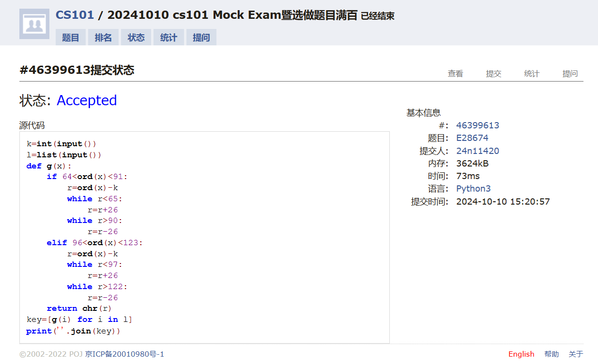
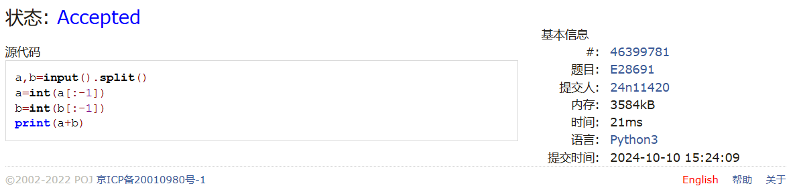
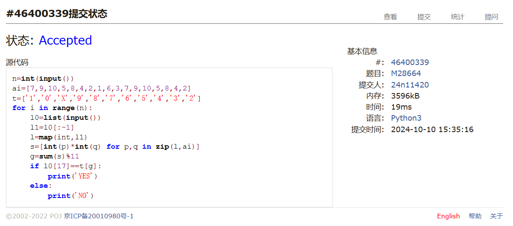
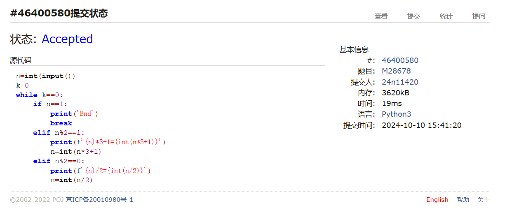
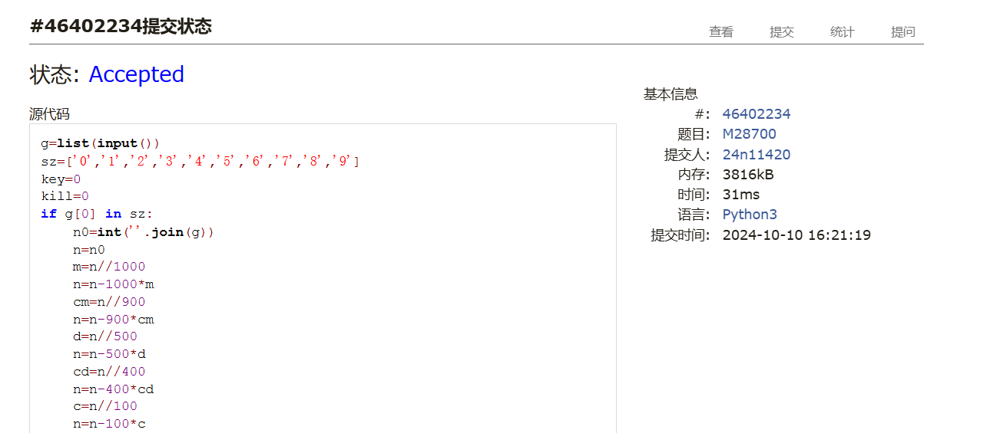
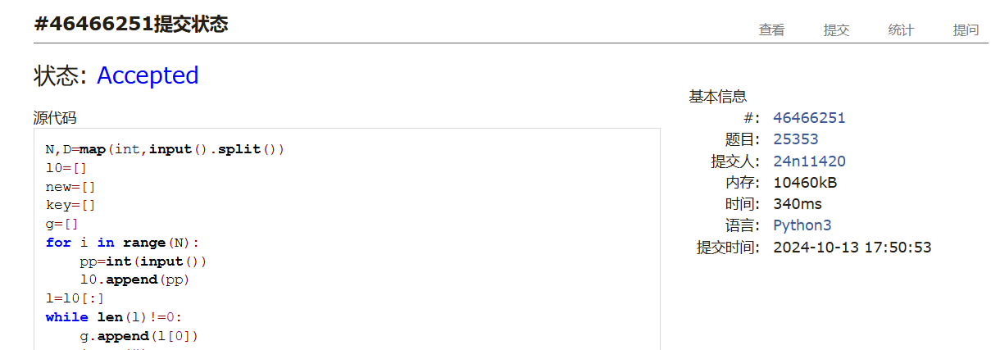

# Assign #3: Oct Mock Exam暨选做题目满百

Updated 1537 GMT+8 Oct 10, 2024

2024 fall, Complied by 物理学院 王思远


**说明：**

1）Oct⽉考： AC5。考试题⽬都在“题库（包括计概、数算题目）”⾥⾯，按照数字题号能找到，可以重新提交。作业中提交⾃⼰最满意版本的代码和截图。

2）请把每个题目解题思路（可选），源码Python, 或者C++/C（已经在Codeforces/Openjudge上AC），截图（包含Accepted, 学号），填写到下面作业模版中（推荐使用 typora https://typoraio.cn ，或者用word）。AC 或者没有AC，都请标上每个题目大致花费时间。

3）提交时候先提交pdf文件，再把md或者doc文件上传到右侧“作业评论”。Canvas需要有同学清晰头像、提交文件有pdf、作业评论有md或者doc。

4）如果不能在截止前提交作业，请写明原因。


## 1. 题目

### E28674:《黑神话：悟空》之加密

http://cs101.openjudge.cn/practice/28674/


思路：


代码

```python
k=int(input())
l=list(input())
def g(x):
    if 64<ord(x)<91:
        r=ord(x)-k
        while r<65:
            r=r+26
        while r>90:
            r=r-26
    elif 96<ord(x)<123:
        r=ord(x)-k
        while r<97:
            r=r+26
        while r>122:
            r=r-26
    return chr(r)
key=[g(i) for i in l]
print(''.join(key))

```


代码运行截图 ==（至少包含有"Accepted"）==



### E28691: 字符串中的整数求和

http://cs101.openjudge.cn/practice/28691/


思路：


代码

```python
a,b=input().split()
a=int(a[:-1])
b=int(b[:-1])
print(a+b)

```


代码运行截图 ==（至少包含有"Accepted"）==



### M28664: 验证身份证号

http://cs101.openjudge.cn/practice/28664/


思路：


代码

```python
n=int(input())
ai=[7,9,10,5,8,4,2,1,6,3,7,9,10,5,8,4,2]
t=['1','0','X','9','8','7','6','5','4','3','2']
for i in range(n):
    l0=list(input())
    l1=l0[:-1]
    l=map(int,l1)
    s=[int(p)*int(q) for p,q in zip(l,ai)]
    g=sum(s)%11
    if l0[17]==t[g]:
        print('YES')
    else:
        print('NO')

```


代码运行截图 ==（AC代码截图，至少包含有"Accepted"）==



### M28678: 角谷猜想

http://cs101.openjudge.cn/practice/28678/


思路：


代码

```python
n=int(input())
k=0
while k==0:
    if n==1:
        print('End')
        break
    elif n%2==1:
        print(f'{n}*3+1={int(n*3+1)}')
        n=int(n*3+1)
    elif n%2==0:
        print(f'{n}/2={int(n/2)}')
        n=int(n/2)

```


代码运行截图 ==（AC代码截图，至少包含有"Accepted"）==



### M28700: 罗马数字与整数的转换

http://cs101.openjudge.cn/practice/28700/


思路：


##### 代码

```python
# 
g=list(input())
sz=['0','1','2','3','4','5','6','7','8','9']
key=0
kill=0
if g[0] in sz:
    n0=int(''.join(g))
    n=n0
    m=n//1000
    n=n-1000*m
    cm=n//900
    n=n-900*cm
    d=n//500
    n=n-500*d
    cd=n//400
    n=n-400*cd
    c=n//100
    n=n-100*c
    xc=n//90
    n=n-90*xc
    l=n//50
    n=n-50*l
    xl=n//40
    n=n-40*xl
    x=n//10
    n=n-10*x
    ix=n//9
    n=n-9*ix
    v=n//5
    n=n-5*v
    iv=n//4
    n=n-4*iv
    i=n
    st=['M'*m,'CM'*cm,'D'*d,'CD'*cd,'C'*c,'XC'*xc,'L'*l,'XL'*xl,'X'*x,'IX'*ix,'V'*v,'IV'*iv,'I'*i]
    print(''.join(st))
else:
    for pp in range(len(g)):
        if pp==len(g)-1:
            k=1
        else:
            k=0
        if kill==1:
            kill=0
            continue
        if g[pp]=='M':
            key=key+1000
        elif g[pp]=='D':
            key=key+500
        elif g[pp]=='C':
            if k==0:
                if g[pp+1]=='M':
                    key=key+900
                    kill=1
                elif g[pp+1]=='D':
                    key=key+400
                    kill=1
                else:
                    key=key+100
            else:
                key=key+100
        elif g[pp]=='L':
            key=key+50
        elif g[pp]=='X':
            if k == 0:
                if g[pp + 1] == 'C':
                    key = key + 90
                    kill = 1
                elif g[pp + 1] == 'L':
                    key = key + 40
                    kill = 1
                else:
                    key = key + 10
            else:
                key = key + 10
        elif g[pp]=='V':
            key=key+5
        elif g[pp]=='I':
            if k==0:
                if g[pp+1]=='X':
                    key=key+9
                    kill=1
                elif g[pp+1]=='V':
                    key=key+4
                    kill=1
                else:
                    key=key+1
            else:
                key=key+1
    print(key)
```


代码运行截图 ==（AC代码截图，至少包含有"Accepted"）==



### *T25353: 排队 （选做）

http://cs101.openjudge.cn/practice/25353/


思路：


代码

```python
N,D=map(int,input().split())
l0=[]
new=[]
key=[]
g=[]
for i in range(N):
    pp=int(input())
    l0.append(pp)
l=l0[:]
while len(l)!=0:
    g.append(l[0])
    l.pop(0)
    ma=mi=g[0]
    for i in l:
        if ma-D<=i<=mi+D:
            g.append(i)
        else:
            new.append(i)
        ma = max(ma, i)
        mi = min(mi, i)
    l=new[:]
    new=[]
    g.sort()
    for i in g:
        key.append(i)
    g=[]
for i in key:
    print(i)

```


代码运行截图 ==（AC代码截图，至少包含有"Accepted"）==



## 2. 学习总结和收获

==如果作业题目简单，有否额外练习题目，比如：OJ“计概2024fall每日选做”、CF、LeetCode、洛谷等网站题目。==
继续在做每日选做，因为开课后才开始做，所以还没赶上进度，考试还有最近的题能感觉到变难了，做出来的超时变多了，现在每日选做openjudge的题挺多，一出错看不见出错数据，题目的样例简单用处不大，一些题只有一组样例数据，不太好找问题，找不出来的话很浪费时间。
另外这次月考我发现考试和平常做题状态不一样，比如上面那个罗马数字那个代码，平常肯定不写成那样，考试的时候倾向于赶紧写并且写结构简单的，可能也跟我水平不高有关系，这次月考还是有很多收获的


