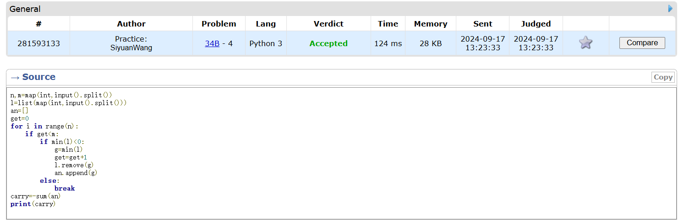
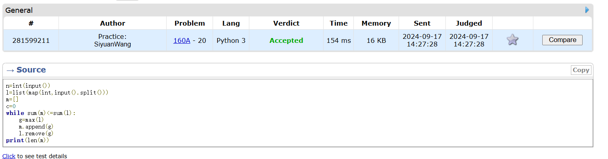
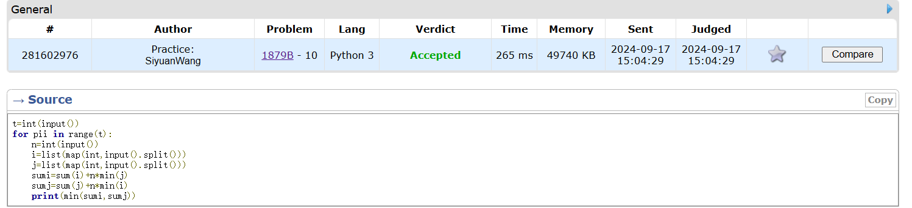
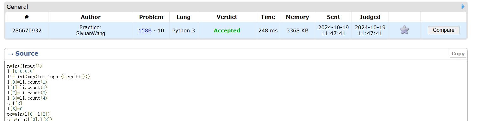
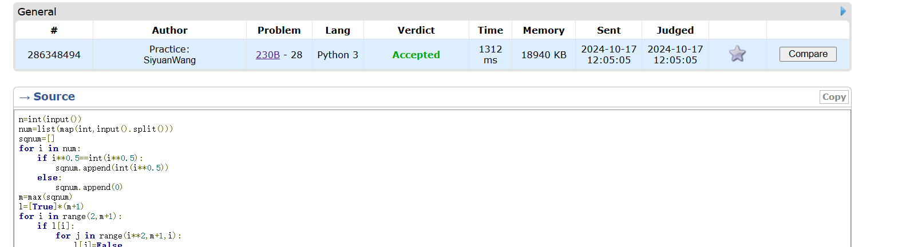
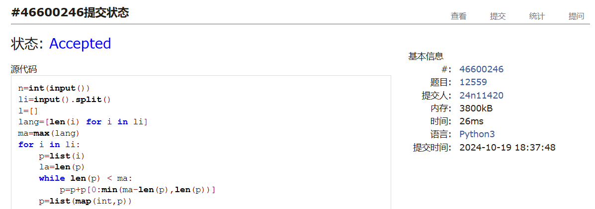

# Assignment #4: T-primes + 贪心

Updated 0337 GMT+8 Oct 15, 2024

2024 fall, Complied by <mark>同学的姓名、院系</mark>


**说明：**

1）请把每个题目解题思路（可选），源码Python, 或者C++（已经在Codeforces/Openjudge上AC），截图（包含Accepted），填写到下面作业模版中（推荐使用 typora https://typoraio.cn ，或者用word）。AC 或者没有AC，都请标上每个题目大致花费时间。

3）课程网站是Canvas平台, https://pku.instructure.com, 学校通知9月19日导入选课名单后启用。**作业写好后，保留在自己手中，待9月20日提交。**

提交时候先提交pdf文件，再把md或者doc文件上传到右侧“作业评论”。Canvas需要有同学清晰头像、提交文件有pdf、"作业评论"区有上传的md或者doc附件。

4）如果不能在截止前提交作业，请写明原因。


## 1. 题目

### 34B. Sale

greedy, sorting, 900, https://codeforces.com/problemset/problem/34/B


思路：


代码

```python
# 
n,m=map(int,input().split())
l=list(map(int,input().split()))
an=[]
get=0
for i in range(n):
    if get<m:
        if min(l)<0:
            g=min(l)
            get=get+1
            l.remove(g)
            an.append(g)
        else:
            break
carry=-sum(an)
print(carry)
```


代码运行截图 <mark>（至少包含有"Accepted"）</mark>



### 160A. Twins

greedy, sortings, 900, https://codeforces.com/problemset/problem/160/A

思路：


代码

```python
n=int(input())
l=list(map(int,input().split()))
m=[]
c=0
while sum(m)<=sum(l):
    g=max(l)
    m.append(g)
    l.remove(g)
print(len(m))


```


代码运行截图 ==（至少包含有"Accepted"）==



### 1879B. Chips on the Board

constructive algorithms, greedy, 900, https://codeforces.com/problemset/problem/1879/B

思路：


代码

```python
t=int(input())
for pii in range(t):
    n=int(input())
    i=list(map(int,input().split()))
    j=list(map(int,input().split()))
    sumi=sum(i)+n*min(j)
    sumj=sum(j)+n*min(i)
    print(min(sumi,sumj))

```


代码运行截图 <mark>（至少包含有"Accepted"）</mark>



### 158B. Taxi

*special problem, greedy, implementation, 1100, https://codeforces.com/problemset/problem/158/B

思路：


代码

```python
n=int(input())
l=[0,0,0,0]
li=list(map(int,input().split()))
l[0]=li.count(1)
l[1]=li.count(2)
l[2]=li.count(3)
l[3]=li.count(4)
c=l[3]
l[3]=0
pp=min(l[0],l[2])
c=c+min(l[0],l[2])
l[0]=l[0]-pp
l[2]=l[2]-pp
c=c+l[1]//2
l[1]=l[1]%2
if l[1]!=0:
    c=c+1
    l[1]=0
    l[0]=l[0]-min(2,l[0])
if l[2]!=0:
    c=c+l[2]
    l[2]=0
if l[0]!=0:
    c=c+l[0]//4
    if l[0]%4!=0:
        c=c+1
        l[0]=0
print(c)

```


代码运行截图 <mark>（至少包含有"Accepted"）</mark>



### *230B. T-primes（选做）

binary search, implementation, math, number theory, 1300, http://codeforces.com/problemset/problem/230/B

思路：


代码

```python
n=int(input())
num=list(map(int,input().split()))
sqnum=[]
for i in num:
    if i**0.5==int(i**0.5):
        sqnum.append(int(i**0.5))
    else:
        sqnum.append(0)
m=max(sqnum)
l=[True]*(m+1)
for i in range(2,m+1):
    if l[i]:
        for j in range(i**2,m+1,i):
            l[j]=False
l[0]=False
t=[l[x] for x in sqnum]
for i in range(n):
    if num[i]==1 or 0:
        print('NO')
    elif t[i]:
        print('YES')
    else:
        print('NO')

```


代码运行截图 <mark>（至少包含有"Accepted"）</mark>



### *12559: 最大最小整数 （选做）

greedy, strings, sortings, http://cs101.openjudge.cn/practice/12559

思路：


代码

```python
n=int(input())
li=input().split()
l=[]
lang=[len(i) for i in li]
ma=max(lang)
for i in li:
    p=list(i)
    la=len(p)
    while len(p) < ma:
        p=p+p[0:min(ma-len(p),len(p))]
    p=list(map(int,p))
    pp=[p,la]
    l.append(pp)
l.sort(reverse=True)
ma=''
for i in l:
    for j in i[0][:i[1]]:
        ma=ma+str(j)
mi=''
for i in range(len(l)):
    for j in l[len(l)-1-i][0][:l[len(l)-1-i][1]]:
        mi=mi+str(j)
print(int(ma),int(mi))

```


代码运行截图 <mark>（至少包含有"Accepted"）</mark>



## 2. 学习总结和收获

<mark>如果作业题目简单，有否额外练习题目，比如：OJ“计概2024fall每日选做”、CF、LeetCode、洛谷等网站题目。</mark>
继续做每日选做,感觉现在题目难度上来了,因为一周有几天课比较满,加上题目难了做得更慢,每日选做进度还没赶上来.现在遇到最大问题就是超时,有时候超时要优化好久,提交好几次,实在不知道哪慢了才会看题解,应该还得一段时间才能赶上每日选做进度.


