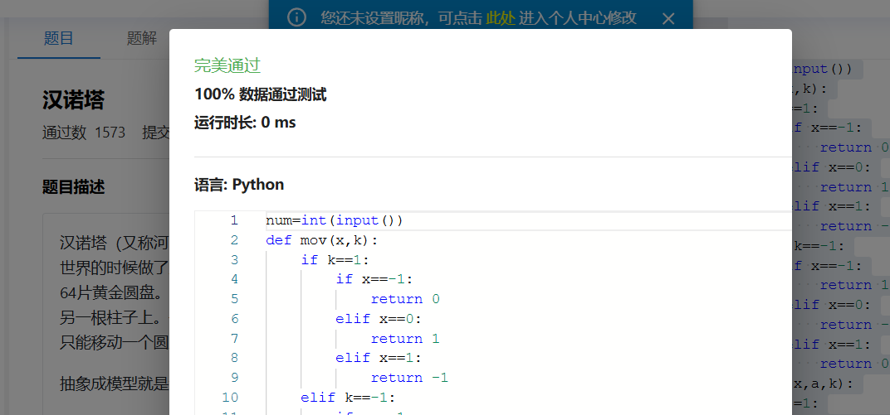
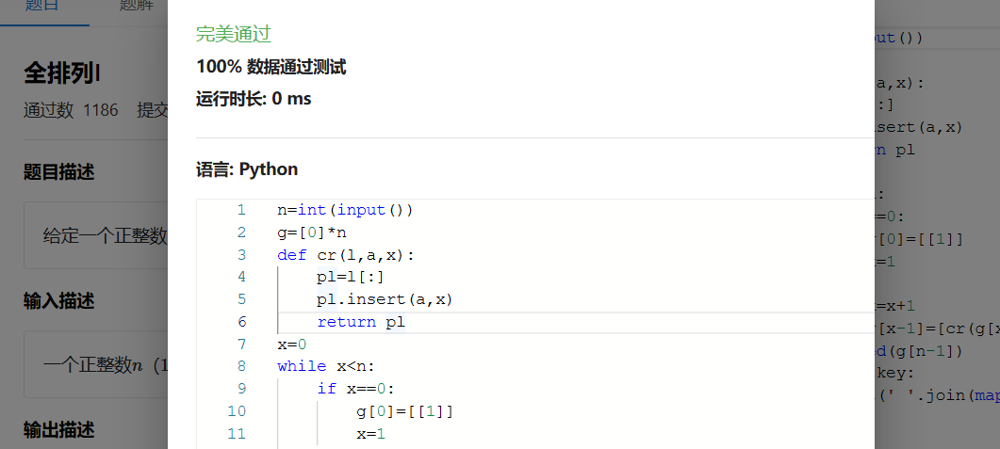
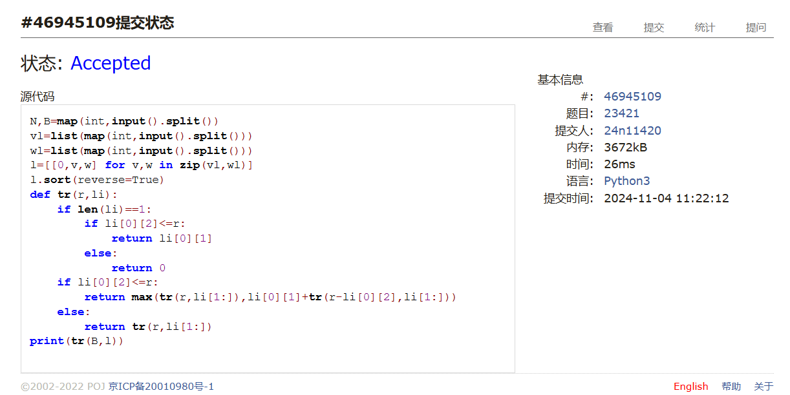
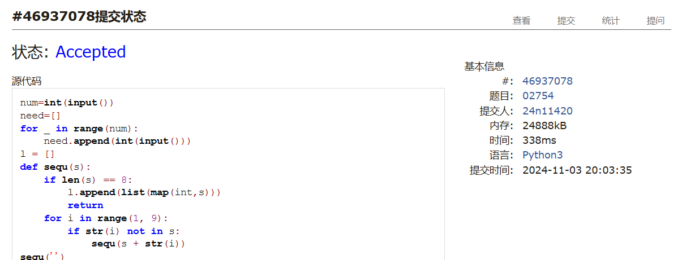
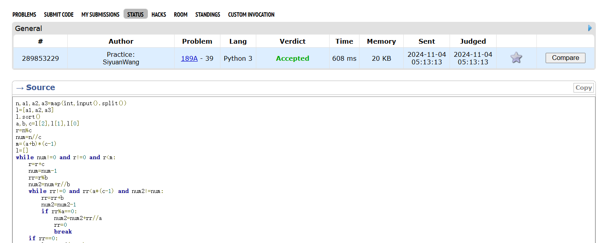

# Assignment #6: Recursion and DP

Updated 2201 GMT+8 Oct 29, 2024

2024 fall, Complied by <mark>同学的姓名、院系</mark>


**说明：**

1）请把每个题目解题思路（可选），源码Python, 或者C++（已经在Codeforces/Openjudge上AC），截图（包含Accepted），填写到下面作业模版中（推荐使用 typora https://typoraio.cn ，或者用word）。AC 或者没有AC，都请标上每个题目大致花费时间。

3）提交时候先提交pdf文件，再把md或者doc文件上传到右侧“作业评论”。Canvas需要有同学清晰头像、提交文件有pdf、"作业评论"区有上传的md或者doc附件。

4）如果不能在截止前提交作业，请写明原因。


## 1. 题目

### sy119: 汉诺塔

recursion, https://sunnywhy.com/sfbj/4/3/119  

思路：


代码：

```python
num=int(input())
def mov(x,k):
    if k==1:
        if x==-1:
            return 0
        elif x==0:
            return 1
        elif x==1:
            return -1
    elif k==-1:
        if x==-1:
            return 1
        elif x==0:
            return -1
        elif x==1:
            return 0
def move(x,a,k):
    if x!=1:
        l=move(x-1,a,-k)+[[a,mov(a,k)]]+move(x-1,mov(a,-k),-k)
    elif x==1:
        l=[[a,mov(a,k)]]
    return l
dic={-1:'B',0:'A',1:'C'}
key=move(num,0,1)
print(len(key))
for i in key:
    print(f'{dic[i[0]]}->{dic[i[1]]}')
```


代码运行截图 <mark>（至少包含有"Accepted"）</mark>



### sy132: 全排列I

recursion, https://sunnywhy.com/sfbj/4/3/132

思路：


代码：

```python
n=int(input())
g=[0]*n
def cr(l,a,x):
    pl=l[:]
    pl.insert(a,x)
    return pl
x=0
while x<n:
    if x==0:
        g[0]=[[1]]
        x=1
    else:
        x=x+1
        g[x-1]=[cr(g[x-2][i],a,x) for a in range(x) for i in range(len(g[x-2]))]
key=sorted(g[n-1])
for i in key:
    print(' '.join(map(str,i)))
```


代码运行截图 ==（至少包含有"Accepted"）==



### 02945: 拦截导弹 

dp, http://cs101.openjudge.cn/2024fallroutine/02945

思路：


代码：

```python
k=int(input())
l=list(map(int,input().split()))
kl=[1]
for i in range(1,k):
    ma=1
    for j in range(len(kl)):
        if l[i]<=l[j]:
            ma=max(ma,kl[j]+1)
    kl.append(ma)
print(max(kl))
```


代码运行截图 <mark>（至少包含有"Accepted"）</mark>


### 23421: 小偷背包 

dp, http://cs101.openjudge.cn/practice/23421

思路：


代码：

```python
N,B=map(int,input().split())
vl=list(map(int,input().split()))
wl=list(map(int,input().split()))
l=[[0,v,w] for v,w in zip(vl,wl)]
l.sort(reverse=True)
def tr(r,li):
    if len(li)==1:
        if li[0][2]<=r:
            return li[0][1]
        else:
            return 0
    if li[0][2]<=r:
        return max(tr(r,li[1:]),li[0][1]+tr(r-li[0][2],li[1:]))
    else:
        return tr(r,li[1:])
print(tr(B,l))
```


代码运行截图 <mark>（至少包含有"Accepted"）</mark>



### 02754: 八皇后

dfs and similar, http://cs101.openjudge.cn/practice/02754

思路：


代码：

```python
num=int(input())
need=[]
for _ in range(num):
    need.append(int(input()))
l = []
def sequ(s):
    if len(s) == 8:
        l.append(list(map(int,s)))
        return
    for i in range(1, 9):
        if str(i) not in s:
            sequ(s + str(i))
sequ('')
lx1=[[i+li[i] for i in range(8)] for li in l]
lx2=[[-i+li[i] for i in range(8)] for li in l]
ban=set()
for i in range(len(l)):
    if len(lx1[i])!=len(set(lx1[i])) or len(lx2[i])!=len(set(lx2[i])):
        ban.add(i)
lk=[l[i] for i in range(len(l)) if i not in ban]
lk.sort()
for i in need:
    print(''.join(map(str,lk[i-1])))
```


代码运行截图 <mark>（至少包含有"Accepted"）</mark>



### 189A. Cut Ribbon 

brute force, dp 1300 https://codeforces.com/problemset/problem/189/A

思路：


代码：

```python
n,a1,a2,a3=map(int,input().split())
l=[a1,a2,a3]
l.sort()
a,b,c=l[2],l[1],l[0]
r=n%c
num=n//c
m=(a+b)*(c-1)
l=[]
while num!=0 and r!=0 and r<m:
    r=r+c
    num=num-1
    rr=r%b
    num2=num+r//b
    while rr!=0 and rr<a*(c-1) and num2!=num:
        rr=rr+b
        num2=num2-1
        if rr%a==0:
            num2=num2+rr//a
            rr=0
            break
    if rr==0:
        l.append(num2)
if r==0:
    l.append(num)
print(max(l))
```


代码运行截图 <mark>（至少包含有"Accepted"）</mark>



## 2. 学习总结和收获

<mark>如果作业题目简单，有否额外练习题目，比如：OJ“计概2024fall每日选做”、CF、LeetCode、洛谷等网站题目。</mark>
由于要期中考试加上最近题目不简单,只做了作业,没怎么做每日选做,期中都考完之后补一下每日选做.


