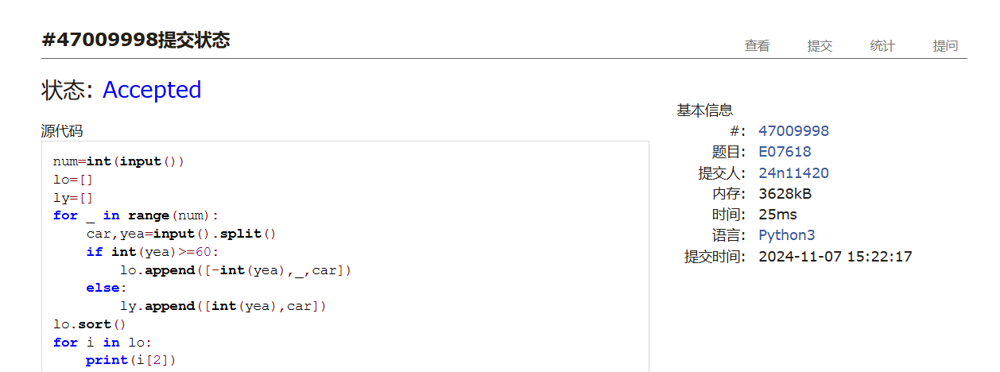
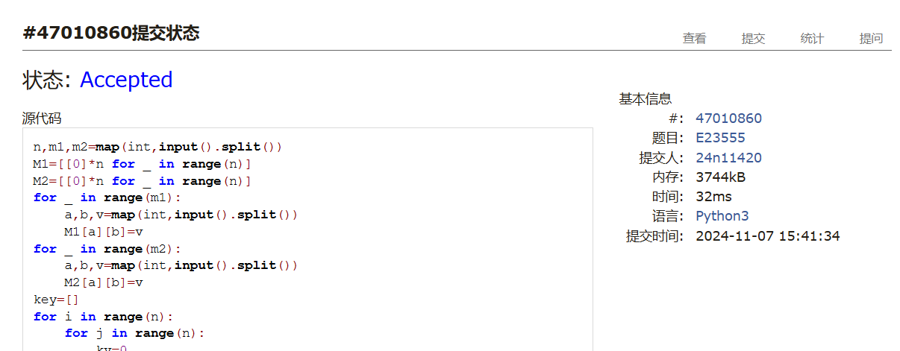
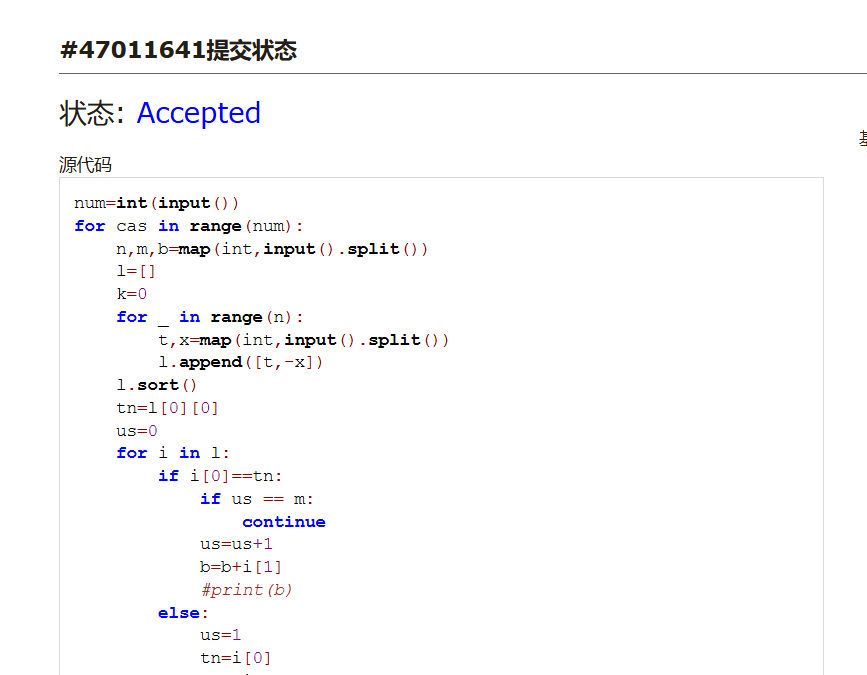
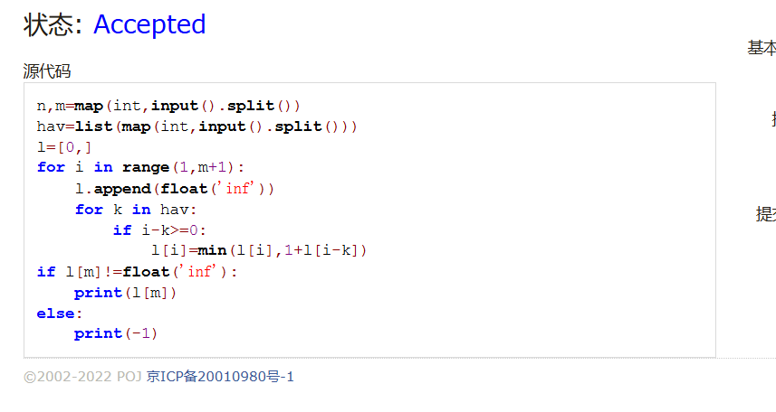
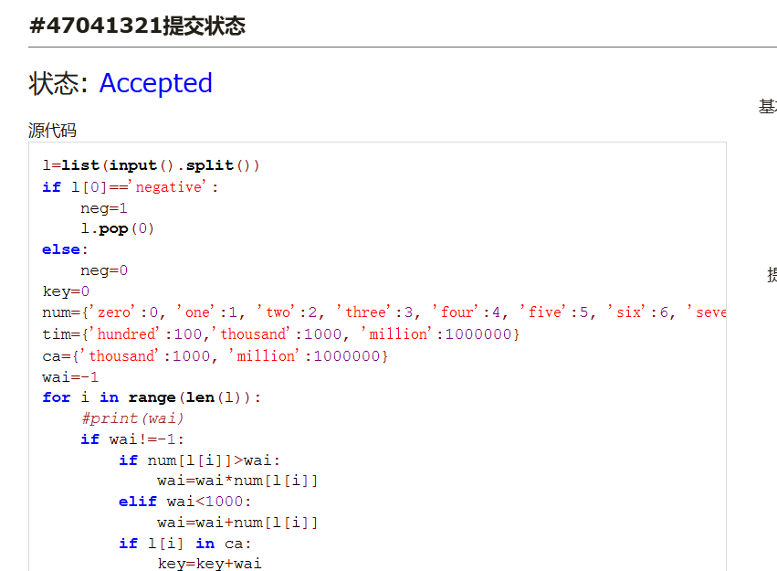
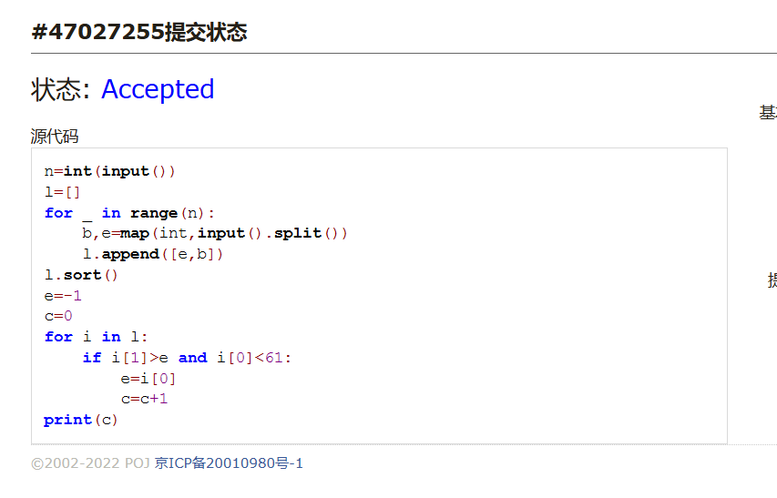

# Assignment #7: Nov Mock Exam立冬

Updated 1646 GMT+8 Nov 7, 2024

2024 fall, Complied by <mark>同学的姓名、院系</mark>


**说明：**

1）⽉考： AC4<mark>（请改为同学的通过数）</mark> 。考试题⽬都在“题库（包括计概、数算题目）”⾥⾯，按照数字题号能找到，可以重新提交。作业中提交⾃⼰最满意版本的代码和截图。

2）请把每个题目解题思路（可选），源码Python, 或者C++（已经在Codeforces/Openjudge上AC），截图（包含Accepted），填写到下面作业模版中（推荐使用 typora https://typoraio.cn ，或者用word）。AC 或者没有AC，都请标上每个题目大致花费时间。

3）提交时候先提交pdf文件，再把md或者doc文件上传到右侧“作业评论”。Canvas需要有同学清晰头像、提交文件有pdf、"作业评论"区有上传的md或者doc附件。

4）如果不能在截止前提交作业，请写明原因。


## 1. 题目

### E07618: 病人排队

sorttings, http://cs101.openjudge.cn/practice/07618/

思路：


代码：

```python
num=int(input())
lo=[]
ly=[]
for _ in range(num):
    car,yea=input().split()
    if int(yea)>=60:
        lo.append([-int(yea),_,car])
    else:
        ly.append([int(yea),car])
lo.sort()
for i in lo:
    print(i[2])
for i in ly:
    print(i[1])
```


代码运行截图 <mark>（至少包含有"Accepted"）</mark>



### E23555: 节省存储的矩阵乘法

implementation, matrices, http://cs101.openjudge.cn/practice/23555/

思路：


代码：

```python
n,m1,m2=map(int,input().split())
M1=[[0]*n for _ in range(n)]
M2=[[0]*n for _ in range(n)]
for _ in range(m1):
    a,b,v=map(int,input().split())
    M1[a][b]=v
for _ in range(m2):
    a,b,v=map(int,input().split())
    M2[a][b]=v
key=[]
for i in range(n):
    for j in range(n):
        kv=0
        for k in range(n):
            kv=kv+M1[i][k]*M2[k][j]
        if kv!=0:
            key.append([i,j,kv])
for i in key:
    print(' '.join(map(str,i)))
```


代码运行截图 ==（至少包含有"Accepted"）==



### M18182: 打怪兽 

implementation/sortings/data structures, http://cs101.openjudge.cn/practice/18182/

思路：


代码：

```python
num=int(input())
for cas in range(num):
    n,m,b=map(int,input().split())
    l=[]
    k=0
    for _ in range(n):
        t,x=map(int,input().split())
        l.append([t,-x])
    l.sort()
    tn=l[0][0]
    us=0
    for i in l:
        if i[0]==tn:
            if us == m:
                continue
            us=us+1
            b=b+i[1]
            #print(b)
        else:
            us=1
            tn=i[0]
            b=b+i[1]
            #print(b)
        if b<=0:
            print(tn)
            k=1
            break
    if k==0:
        print('alive')
    #print(l)

```


代码运行截图 <mark>（至少包含有"Accepted"）</mark>



### M28780: 零钱兑换3

dp, http://cs101.openjudge.cn/practice/28780/

思路：


代码：

```python
n,m=map(int,input().split())
hav=list(map(int,input().split()))
l=[0,]
for i in range(1,m+1):
    l.append(float('inf'))
    for k in hav:
        if i-k>=0:
            l[i]=min(l[i],1+l[i-k])
if l[m]!=float('inf'):
    print(l[m])
else:
    print(-1)
```


代码运行截图 <mark>（至少包含有"Accepted"）</mark>




### T12757: 阿尔法星人翻译官

implementation, http://cs101.openjudge.cn/practice/12757

思路：


代码：

```python
l=list(input().split())
if l[0]=='negative':
    neg=1
    l.pop(0)
else:
    neg=0
key=0
num={'zero':0, 'one':1, 'two':2, 'three':3, 'four':4, 'five':5, 'six':6, 'seven':7, 'eight':8, 'nine':9, 'ten':10, 'eleven':11, 'twelve':12, 'thirteen':13, 'fourteen':14, 'fifteen':15, 'sixteen':16, 'seventeen':17, 'eighteen':18, 'nineteen':19, 'twenty':20, 'thirty':30, 'forty':40, 'fifty':50, 'sixty':60, 'seventy':70, 'eighty':80, 'ninety':90, 'hundred':100, 'thousand':1000, 'million':1000000}
tim={'hundred':100,'thousand':1000, 'million':1000000}
ca={'thousand':1000, 'million':1000000}
wai=-1
for i in range(len(l)):
    #print(wai)
    if wai!=-1:
        if num[l[i]]>wai:
            wai=wai*num[l[i]]
        elif wai<1000:
            wai=wai+num[l[i]]
        if l[i] in ca:
            key=key+wai
            wai=-1
    else:
        wai=num[l[i]]
if wai!=-1:
    key=key+wai
if neg==1:
    print(-key)
else:
    print(key)


```


代码运行截图 <mark>（至少包含有"Accepted"）</mark>



### T16528: 充实的寒假生活

greedy/dp, cs10117 Final Exam, http://cs101.openjudge.cn/practice/16528/

思路：


代码：

```python
n=int(input())
l=[]
for _ in range(n):
    b,e=map(int,input().split())
    l.append([e,b])
l.sort()
e=-1
c=0
for i in l:
    if i[1]>e and i[0]<61:
        e=i[0]
        c=c+1
print(c)
```


代码运行截图 <mark>（至少包含有"Accepted"）</mark>



## 2. 学习总结和收获

<mark>如果作业题目简单，有否额外练习题目，比如：OJ“计概2024fall每日选做”、CF、LeetCode、洛谷等网站题目。</mark>
因为最近有好几个期中考试,很少做每日选做,月考的时候有两三个题没做出来,回去之后从做了一下. 另外仍然感觉一些题样例非常敷衍,样例都是最最简单的情况,甚至一次输入好几个相同的情况做样例,不知道这样的样例有什么用.


